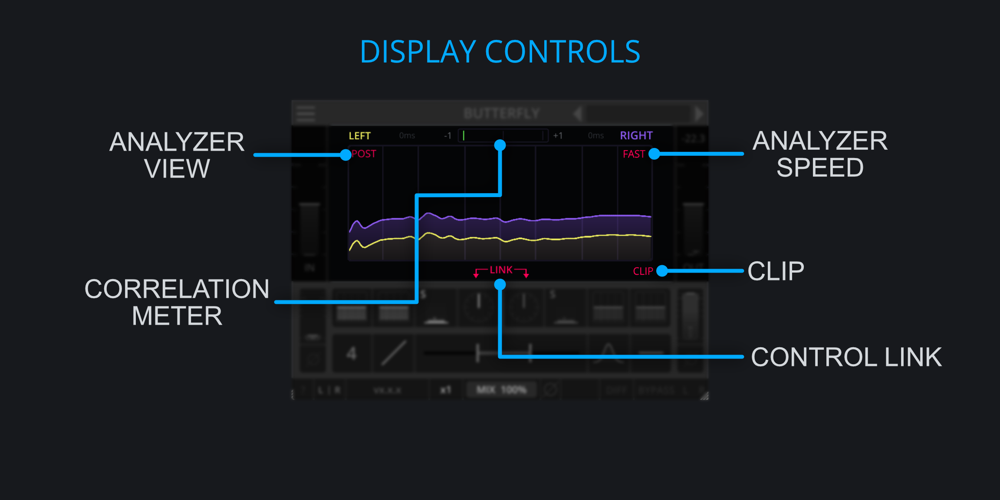

<h2 class="txt-blue">Display Controls</h2>

### Corelation Meter
*(Located above the analyzer)*\
The correlation meter is a common indicator for showing how mono-compatible the signal is.

### Analyer View
*(Located at the top left edge of the analyzer)*\

- Left-Click Cycle through analyzer modes.

The analyer has 3 different display modes:

- Off: Disables the spectrum analyzer.
- Pre: Displays the incoming signal.
- Post: Displays the outgoing signal.

### Analyer Timing
*(Located at the top right of the plugin)*\

- Left-Click Cycle through analyzer timings.

The analyer has different timings, allowing to change how fast it rises and falls:

- Slow: Rise time: 750ms, Fall time: 3.0s.
- Med: Rise time: 100ms, Fall time: 400ms .
- Fast: Rise time: 37.5ms, Fall time: 150ms.

### Link
*(Located below the analyzer)*\

- Left-Click Toggle Control linking.

Links the Channel-Controls (Gain, Phase, Filters, Compressor and Delay) together for changing the values in tandem. 
This provides easy access to modify both channels at the same time.

Please note that this will only affect changes made via the interface and not automation.
If automation is used to change any of the parameters when linking is enabled, only the automated
parameter will change whereas the other counterpart will remain unaffected.

This is to done avoid potentially conflicting input from different automation tracks.

### Clip-Button
*(Located bottom-right of the analyzer)*\

- Left-Click Toggle Clipper.

The built-in clipper prevents the output-signal from going over a certain threshold and becoming too loud, e.x. caused by the SpreadEQ.

