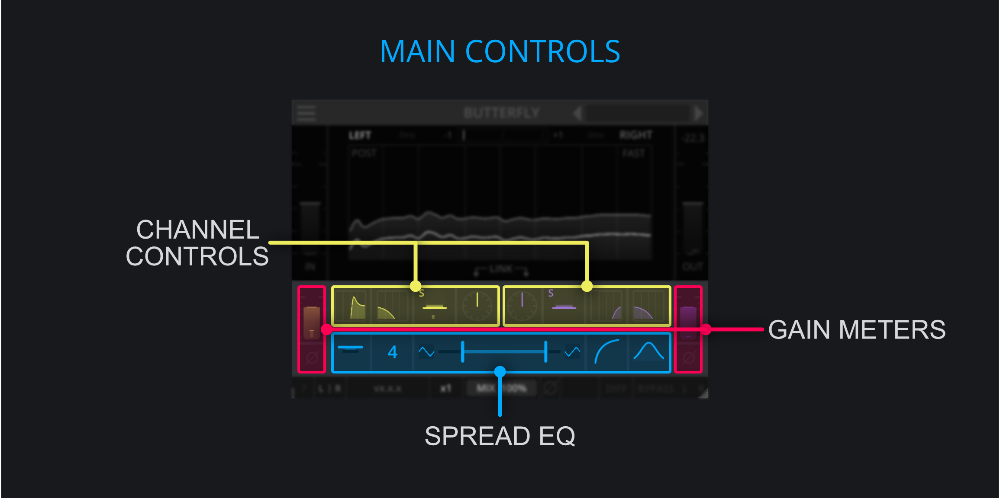

<h2 class="txt-blue">Main Controls</h2>

 

Based on the selected **Processing Mode**, the Channel and Gain controls are working on the Mid/Side or the Left/Right channel.
Their controls are effectively the same for both channels.

