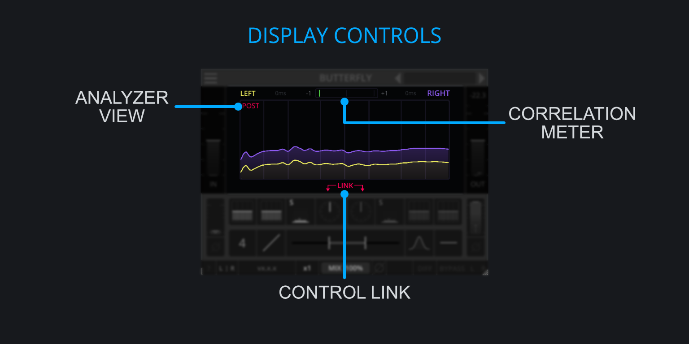

<h3 class="txt-blue">Display Controls</h2>

### Analyer View
*(Located at the edge of the plugin)*\

- Left-Click Cycle through modes.

The analyer has 3 different display modes through which it cycles:

- Off: Disables the spectrum analyzer.
- Pre: Displays the incoming signal.
- Post: Displays the outgoing signal.

### Corelation Meter
*(Located below the gain-slider)*\
The correlation meter is a common indicator for showing how mono-compatible the signal is.

### Link
*(Located bottom-center of the Display)*\
Click to link the Mid-Side-Controls (Gain, Phase, Filters, Compressor and Delay) together for changing the values in tandem. 
This provides easy access to modify both mid and side channels.

Please note that this will only affect changes made via the interface and not automation.
If automation is used to change any of the parameters when linking is enabled, only the automated
parameter will change whereas the other counterpart will remain unaffected.

This is to done avoid potentially conflicting input from different automation tracks.

