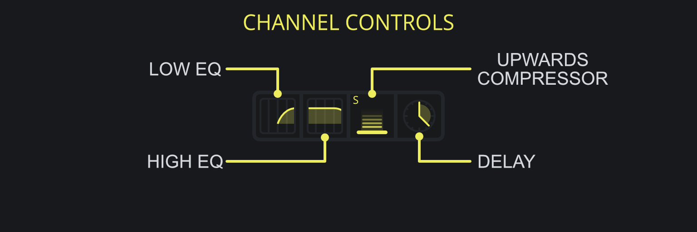

<h3 class="txt-yellow">Channel Controls</h2>

#### Low- and High-EQ-Sliders
*(Located on the left half of the Channel Controls)*\

- Left-Click and Drag Left/Right: Adjust frequency of the respective filter.
- Right-Click: Cycle through different filter states. 
 
- Additionally, when a filter is set to Shelf Mode,
- Left-Click and Drag Up/Down: Change volume.

Both the Low- and High- EQs have 4 different states through which they can be cycled:

- Off: No EQ is applied.
- 1st Order Filter: Applies a 6dB/oct Low- or High- Pass filter.
- 2nd Order Filter: Applies a 12dB/oct Low- or High- Pass filter.
- Shelf: Applies a 12dB/oct Low- or High - Shelf-EQ to the signal.

#### Upwards Compressor
*(Located on the right half of the Channel Controls)*\

- Left-Click and Drag: Adjust the ratio from 1:1 to 10:1
- Left-Click and Drag: Adjust the threshold from -40dB to +6dB.
- Right-Click: Switch between ***S***low and ***F***ast timings.

While a standard compressor *reduces* the volume and dynamic range when the signal goes *above* the threshold, an upwards compressor *increases* the volume while lowering the dynamic range when the signal goes *below* the threshold, allowing for
an easy way to adjust the volume of quieter material.

The timings of the compressor are automatically calculated based on the incomming signal and vary depending on which mode is active, see the table below for the timings.\

- S (Slow)
- - Attack: 40ms to 400ms
- - Release: 100ms to 1000ms
 
- F (Fast)
- - Attack: 4ms to 40ms
- - Release: 10ms to 100ms

#### Delay
*(Located on the right-most side of the Channel Controls)*\
Left-click and drag to delay the mid- or side-channel signal. This can be used to create depth in a mix (when applied to the side channel) or to introduce comb filtering (when applied to one of the L/R channels).

