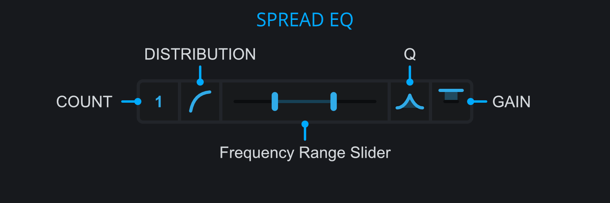

<h3 class="txt-blue">Spread EQ</h2>

The spread EQ applies a series of bell shaped EQs to the left and right channels of a track. Note that the spread EQ is always applied to the left and right channel, regardless of the selected processing mode.

Peaks are applied in alternating order and opposing gain on left and right.
As an example (4 bells from 100Hz to 200Hz, 3dB Gain):

- First peak (100Hz): left +3dB, right -3dB
- Second peak (133Hz): left -3dB, right +3dB
- Third peak (166Hz): left +3dB, right -3dB
- Fourth peak (200Hz): left -3dB, right +3dB

The volume and phase differences introduced by the spread EQ on the two channels cause a wider stereo image while keeping reasonable good mono compatibility.
 

#### Peak Count
*(yes)*\
Click and drag to change the number of bell filters applied.
At a value of zero, no eq is applied, effectively bypassing the spread EQ.
An odd number of modes will increase the volume on one side. If you want to keep even volume, select an even number of modes.

#### Peak Distribution Slider
*(yes)*\
Click and drag to change the frequency distribution for the bell EQs from linear to logarithmic.
Perception of frequencies happens logarithmically: An octave above 100Hz is 200Hz. With narrow Q this can be used to create a harmonic series of peaks.

#### Frequency Range Slider
*(yes)*\
Click and drag to adjust the lower and upper frequency bound for the Spread EQ. Those values correspond to the lowest and highest frequencies of the bell eqs.

#### Q-Slider
*(yes)*\
Click and drag to adjust the Q value of the bell peaks.

#### Gain
*(yes)*\
Click and drag to adjust thegain value of the bell peaks.

