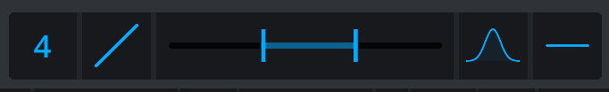

<h2 class="txt-blue">Control Area</h2>

The mid and side controls are basically the same so the following information will
apply to both of them.

### Gain-Slider
*(Located at the outside of the plugin)*\
Left-click and drag to adjust the gain of the respective mid or side channel. This gain is aplied after the upwards compressor, so it can be used as a make-up- (or rather bring-down-)gain of the compressor.

### Phase-Button
*(Located below the gain-slider)*\
Click to cycle through 3 different phase states:

- No-Phase, which leaves the signal as is.
- Pre-Phase, which inverts the polarity at the input of the mid- or side-channel processing.
- Post-Phase, which flips the phase at the output of the mid- or side-channel processing.

### Low- and High-EQ-Sliders
Right-click to change the type of EQ.

- Off, no EQ is applied.
- 1st Order Filter, which applies a 6dB/oct low- or highcut filter.
- 2nd Order Filter, which applies a 12dB/oct low- or highcut filter.
- Shelf, which applies a gentle low- or high-shelf-eq to the signal.

Left-click and drag left to right to adjust the frequency of the respective filter. 
Left-click and drag up/down in **Shelf** mode to adjust the gain (-6dB cut to +6dB boost) of the shelf EQ.

### Upwards Compressor
Left-click and drag the lower part of the widget to adjust the threshold of the upwards compressor.
Left-click and drag the upper part of the widget to adjust the ratio of the upwards compressor.
Right-click the compressor widget to toggle between **F**ast and **S**low timing constants.

While a downwards compressor **reduces** the volume of the signal if it is **above** the threshold, an upwards compressor **increases** the volume of the signal if it is **below** the treshold.
This can be used to easily increase the volume of softer parts.

The upwards compressor uses auto timing. This means the attack and release values are determined by the incoming signal level. Use the input and output gain sliders to adjust the working point of the compressor and thus the timing behavior.

### Delay
Left-click and drag to delay the mid- or side-channel signal. This can be used to create depth in a mix (when applied to the side channel) or to introduce comb filtering (when applied to one of the L/R channels).

### Link
*(Located bottom-center of the Display)*\

Click to link the Mid-Side-Controls (Gain, Phase, Filters, Compressor and Delay) together for changing the values in tandem. 
This provides easy access to modify both mid and side channels.

Please note that this will only affect changes made via the interface and not automation.
If automation is used to change any of the parameters when linking is enabled, only the automated
parameter will change whereas the other counterpart will remain unaffected.

This is to done avoid potentially conflicting input from different automation tracks.

### Spread EQ
*(Located in the bottom of the control area)*\

The spread EQ applies a series of bell shaped EQs to the left and right channels of a track. Note that the spread EQ is always applied to the left and right channel, regardless of the selected processing mode.

Peaks are applied in alternating order and opposing gain on left and right.
As an example (4 bells from 100Hz to 200Hz, 3dB Gain):

- First peak (100Hz): left +3dB, right -3dB
- Second peak (133Hz): left -3dB, right +3dB
- Third peak (166Hz): left +3dB, right -3dB
- Fourth peak (200Hz): left -3dB, right +3dB

The volume and phase differences introduced by the spread EQ on the two channels cause a wider stereo image while keeping reasonable good mono compatibility.

#### Number of Modes

Click and drag to change the number of bell filters applied.

At a value of zero, no eq is applied, effectively bypassing the spread EQ.

An odd number of modes will increase the volume on one side. If you want to keep even volume, select an even number of modes.

#### Peak Distribution Slider

Click and drag to change the frequency distribution for the bell EQs from linear to logarithmic.

Perception of frequencies happens logarithmically: An octave above 100Hz is 200Hz. With narrow Q this can be used to create a harmonic series of peaks.

#### Frequency Range Slider

Click and drag to adjust the lower and upper frequency bound for the Spread EQ. Those values correspond to the lowest and highest frequencies of the bell eqs.

#### Q-Slider

Click and drag to adjust the Q value of the bell peaks.

#### Gain

Click and drag to adjust thegain value of the bell peaks.