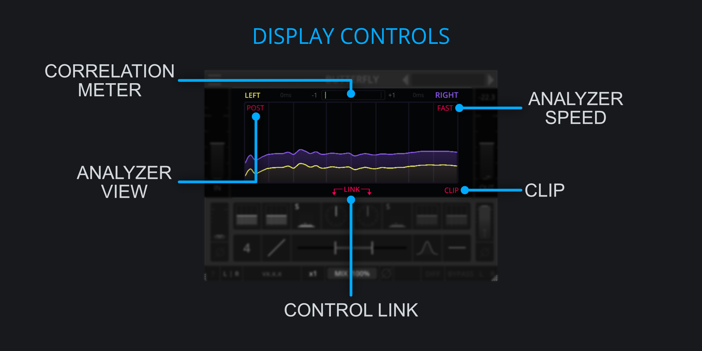

<h2 class="txt-blue">Display Controls</h2>

### Corelation Meter
*(Located above the analyzer)*\
The correlation meter is a common indicator for showing how mono-compatible the signal is. 

- A value of 1 indicates that the left and right chanel are completely in phase. 
- A value of 0 indicates that the left and right channes are not correlated at all.
- A value of -1 indicates that the left and right channels are completely out of phase.

### Analyzer View
*(Located at the top left edge of the analyzer)*\

- Left-Click Cycle through analyzer modes.

The analyzer has 3 different display modes:

- Off: Disables the spectrum analyzer.
- Pre: Displays the incoming signal.
- Post: Displays the outgoing signal.

### Analyzer Timing
*(Located at the top right of the plugin)*\

- Left-Click Cycle through analyzer timings.

The analyzer has different timings, allowing to change how fast it rises and falls:

- Slow: Rise time: 850ms, Fall time: 3.4s.
- Med: Rise time: 150ms, Fall time: 600ms .
- Fast: Rise time: 62.5ms, Fall time: 250ms.

### Clip-Button
*(Located bottom-right of the analyzer)*\

- Left-Click Toggle Clipper.

Some settings of Caterpillar produce strongly resonant boosts, which can lead to damaging speakers or ears. 
The built-in clipper prevents the output-signal from going over the threshold of 0dB and becoming too loud.

**Tip**: The Spread EQ gain and the In gain of the plugin can be used to creatively drive the clipper.

