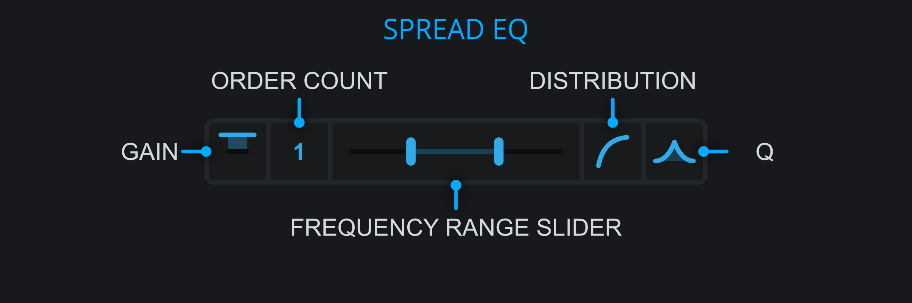

<h3 class="txt-blue">Spread EQ</h2>

The spread EQ applies a series of bell filters to the left and right channels of a track. 

Peaks are applied in alternating order and opposing gain on left and right.
As an example (4 bells from 100Hz to 200Hz, 3dB Gain):

- First peak (100Hz): left +3dB, right -3dB
- Second peak (133Hz): left -3dB, right +3dB
- Third peak (166Hz): left +3dB, right -3dB
- Fourth peak (200Hz): left -3dB, right +3dB

The volume and phase differences introduced by the spread EQ on the two channels cause a wider stereo image while keeping reasonable good mono compatibility.
 

#### Gain
*(Located right of the Spread EQ Widget)*\
Click and drag to adjust the gain of the bell filters.

#### Filter Count
*(Located left of the Spread EQ Widget)*\

- Left-Click and Drag Up/Down: Adjust Filter Count.

The Filter count determines how many "dual" bell-curves are applied within the frequency range.
For each instance, 2 bell-curve filters will be created with opposite gain values where one is placed on the left channel and the other is placed right channel.

A value of 0 will disable the Spread-EQ.
Any odd-values will result in the volume of one of the channels being louder than the other. 
Even counts will keep the volume roughly equal.

#### Frequency Range Slider
*(Located central of the Spread EQ Widget)*\

- Left-Click and Drag Left/Right: Adjust filter placement range.

The Frequency Range slider is a widget separated into 3 components that can each be dragged to
change the value:

- Left Handle:: Adjust the lower-range for the filter placement.
- Middle Rail:: Move the whole range left/right for the filter placement..
- Right Handle:: Adjust the upper-range for the filter placement.

#### Peak Distribution Slider
*(Located left-ish of the Spread EQ Widget)*\

- Left-Click and Drag Left/Right: Adjust filter distribution.

The filter distribution slider allows to place individual bands on a linear and logarithmic
scale (or any mix thereof) within the frequency range.
As the natural perception of frequencies happens logarithmically, setting the value to 100% logarithmic can result in boosting the harmomic series with a narrow Q value.

#### Q-Slider
*(Located right-ish of the Spread EQ Widget)*\

- Left-Click and Drag Left/Right: Adjust Q.

Click and drag to adjust the Q value of the bell peaks.
Large values apply broad preaks, while small values allow for sharp, resonant peaks.

