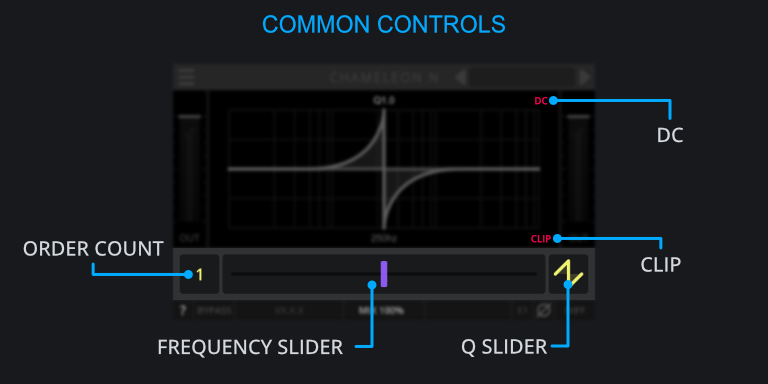
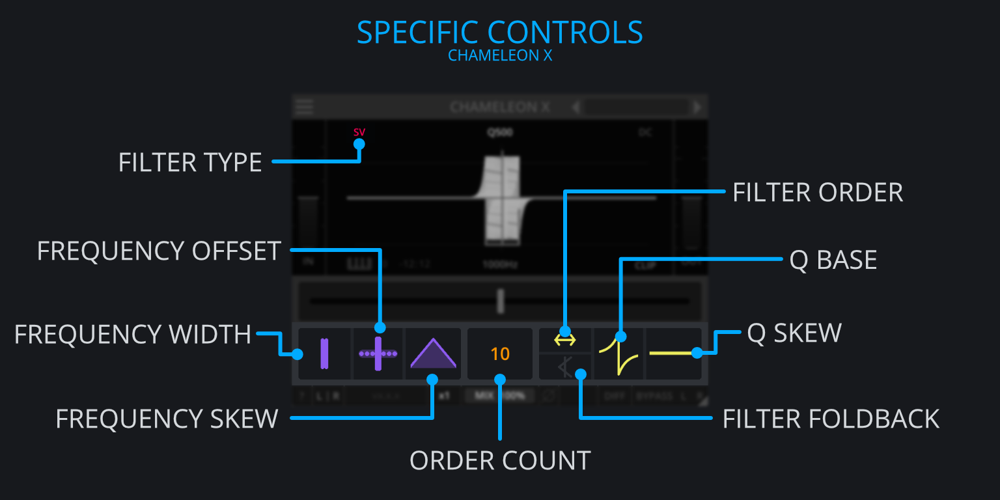

<h2 class="txt-blue">Common Chameleon Controls</h2>

Shared primarily across the Chameleon Suite plugins are a set of
controls including:

- DC Button
- Keytracking Controls
- CLIP Button
- Order Count
- Frequency Slider
- Q Slider

### DC-Button (N, X)
*(Located top-right of the Display)*\
Applies a 10Hz first order high-pass-filter to the output to account for any DC-Offset which 
might be introduced by the plugin.

Generally the frequency response of allpass filters is flat.
However, automating the parameters of multiple allpass filters can often introduce some significant changes, causing dc offset that can potentially damage your speakers and headphones. 

Adding a high-pass-filter will also introduce some phase rotation at low frequencies.

### CLIP (N, X)
*(Located bottom-right of the Display)*\
Click to cycle through 3 stages of clipping:

- No-Clip, which leaves the signal as is.
- Output-Clip, which will hard-clip the output signal.
- Per-Filter-Clip, which will clip the signal per-filter-instance.

#### No Clip
No clipping is applied in this mode.

#### Output Clip
Clips the output at 0db.

#### Per-Filter Clip
Clips after each allpass filter and at the output.
Each allpass filter stage alters the sound in a tiny bit, resulting in tiny differences in the waveform.
This is a great option for sound design work as it offers some unique sounds.

Modulating any of the parameters can introduce strong resonant peaks, and potentially self-oscillating filters.
Those can cause a massive audio energy buildup, which can potentially damage your speakers, 
headphones and ears.
Clipping the output to a maximum of 0dB offers some protection for such measures.

### Keytracking (1, 2, N, X)
*(Located bottom left of the Display)*\

Click to toggle Keytracking.
When enabled, the frequency slider will snap to the frequency of the incoming midi data, including pitch-bend CC.

#### Keytrack-Note offset (1, 2, N, X)
*(Located bottom left of the Display)*\
Click and drag to internally offset the incoming midi notes by the amount of semitones to a range of -24 to +24.

Whilst this is purely the offset in semitones, via the plugin parameters available in your DAW
you can also set an additional linear frequency offset which is currently not available via the UI.

#### Pitchbend Range (up and down) (1, 2, N, X)
*(Located bottom left of the Display)*\
Click and drag to change the pitchbend range for up and down. There is no general range for pitchbend 
which is why we offer the option to set a custom range of -36 to 0 for down and +36 to 0 for up.

Note that it is explicitly possible to have different pitchbend ranges for up and down pitchbend. This allows for some interesting effects, when the pitchbend range matches the sound generator pitchbend in one, but not the other direction.

### Frequency
*(Located in the center of the Control-Area)*\
Click and drag to change the center frequency of the allpass filter(s).

- Chameleon 1 (first-order allpass filter) this corresponds to the 
frequency that has the steepest change in phase rotation.
- Chameleon 2 and N (second-order allpass filters) this corresponds 
to the frequency that has the maximum amount of phase rotation.
- Chameleon X this is the frequency of the central frequency. More 
allpass filters are added based on the other parameters of the plugin

Note that the plugin configuration offers the option to select between linear or exponential frequency control.
See section @sec:configuration for detailed instructions.

### Q (2, N, X)
*(Located right of the Control-Area)*\
Click and drag to adjust the Q value of the filter.
Changing this will adjust the bandwidth where a narrow bandwidth affects only a small range of frequencies, and a large bandwidth affects a large range of frequencies.

In an allpass filter, the Q value determines the range over which the phase rotation happens. 
This allows to confine the space rotation to a very small frequency area or to spread it out over the 
full spectrum.
As the absolute change of phase rotation is fixed, the q control effectively adjusts the steepness of the phase change.

### Order (N, X)
*(Chameleon N: Located left of the Control-Area.)*\
*(Chameleon X: Located center of the Control-Area.)*\
Click and drag to change the amount of filters being stacked.

Both Chameleon N and Chameleon X 
come with the addition of the **Order** Control that allows you to stack multiple allpass filters upon each-other.
Stacking multiple allpass filters increases the phase rotation and overall delay usually resulting in dispersed sounds.

In Chameleon N all the filters are stacked onto a central frequency 
whereas in Chameleon X additional distribution controls are available.

<h2 class="txt-blue">Chameleon X Specific Controls</h2>

### Filter Type
*(Located top-left of the Display)*\
Click to change type of allpass filter. This allows you to swap between currently 2 different 
implementations:

- Generic
- State-Variable

#### Generic
The generic filter type is suited for static placement of the controls.
It allows for a wide range of q values and can be used to create strongly ringing, almost self-oscillating sounds.
So called 'zipper-noises' might occur when controls are automated at high automation speeds.

#### State-Variable
The state-variable filter type is designed for allowing modulation of the controls. 
It allows 'dynamic' placement of the controls.
The state-variable filter wont introduce any 'zipper-noises' but offers a more limited range of q values.

### Frequency Width
*(Located left of the Control-Area)*\
Click and drag to change the total width over which the filters are spread out.

### Frequency Offset
*(Located left of the Control-Area)*\
Click and drag to offset the placement of the filters relative to the center frequency.

At the zero position the allpass filters are distributed around the central frequency, while smaller and larger values
will move the frequency distribution to lower and higher frequencies respectively.

### Frequency Skew
*(Located center-right of the Control-Area)*\
Click and drag to change the placement of the filters relative to the distribution width.

- Values smaller than zero will "pinch" the filter towards the center frequency.
- Value of 0 will distribute the filters equally linearly.
- Values higher than zero will "bloat" the filters away from the center frequency.

### Filter Sorting
*(Located Center-Right of the Control-Area)*\
Click to change the order in which the filters are placed based:

- Ascending (right arrow), places them from lower to higher frequencies.
- Descending (left arrow), places them from higher to lower frequencies.
- Interleaved (left and right arrow), places them from the center outwards.

### Filter Foldback
*(Located center-right of the Control-Area)*\
Click to enable foldback of filters that go outside the audible range.

- A filter that would sit at 10Hz (5Hz below the lowest allowed frequency) will be moved to 20 Hz 
(5Hz above the lowest allowed frequency).
- A filter that would sit at 22kHz (2kHz above the highest allowed frequency) will be moved to 18 kHz 
(2kHz below the highest allowed frequency).

When disengaged, filters will stack at the limits of the allowed frequency range, introducing a buildup of phase rotation around those frequencies.

### Q Skew
*(Located center-right of the Control-Area)*\
Click and drag to change the Q values of the filters dependant on the frequency.

- Values higher than zero will increase the Q based on ascending frequency
- Values of zero will set all filters to the same Q value.
- Values lower than zero will increase the Q based on descending frequency

