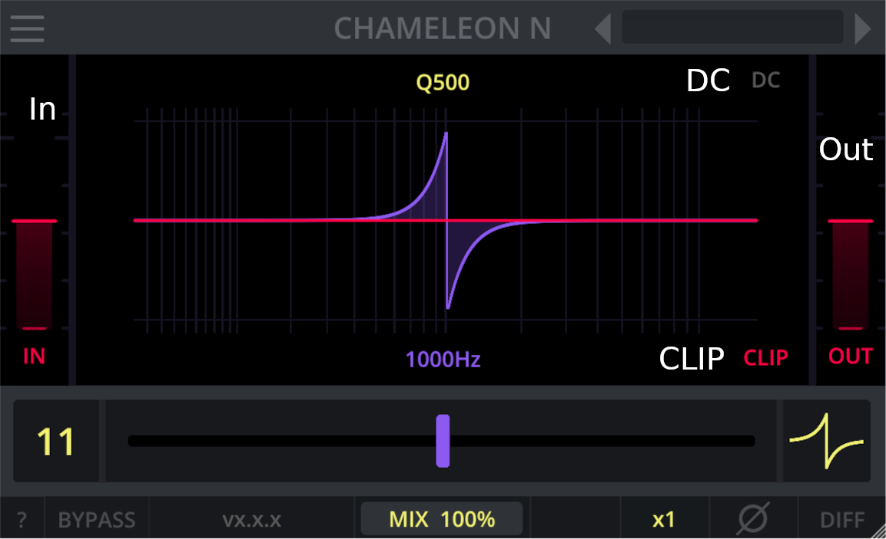
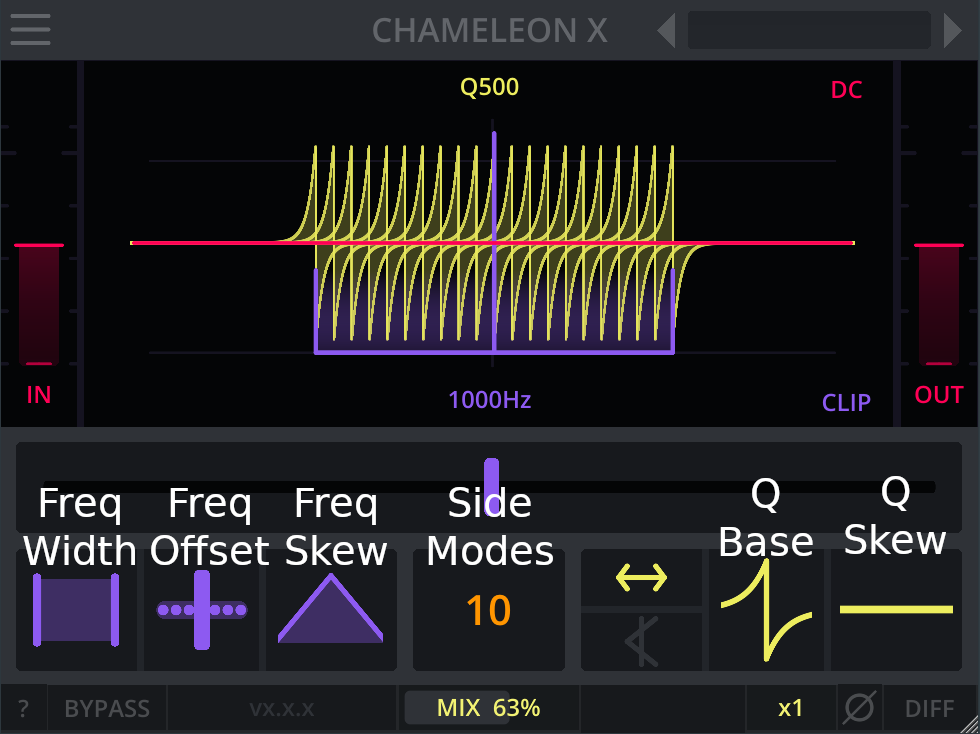

# Controls

General interactions with the UI are:

- A double click on a slider resets the slider to the default value.
- Holding `SHIFT` or `CTRL` while dragging a slider allows for precise adjustments.
- The mouse wheel can be used to adjust a slider in steps.
- Hovering over a control for a short time shows a tooltip.
- Changing the value of any slider makes a tooltip show the current value.
- By engaging the `?` button, in-plugin-explanations are turned on.
- The plugin can be scaled by dragging any of the sides or corners.

## Header Controls

All Darkpalace Studio plugins feature an integrated preset and theme manager.
This manager can be launched from the menu at the top left of the plugin.

The preset manager allows you to save and load and even share presets.
The theme manager allows access to the available themes to customize the look and feel of the plugin.

We highly recommend browsing through the presets and themes in the menu to explore creative options.

### Menu

The preset and theme manager can be accessed by the three lines in the top left of the plugin.
This will open up the menu, where you can browse, load and save presets as well as load themes.

### Previous Preset

For stepping through presets in reverse order, you can use the *previous preset* button

### Current Preset Name

The name of the currently selected preset.
Clicking this control also opens the preset browser.

### Next Preset

For stepping through presets in forward order, you can use the *next preset* button

\newpage

## Footer Controls

### ?

Enables explanations directly in the UI. When enabled, You can hover over a control to get a longer
explanation of the functionality.

### Bypass

Routes the input directly to the output, bypassing the plugin completely. Most of the UI will turn to greyscale,
indicating that bypass is enabled.

### Version

Displays the version of the plugin.
If the explanation mode is enabled via the **?** button you can see the concrete commit hash of the plugin.

### Mix

Blends continuously between the processed and unprocessed signal.

### Oversampling

Selects oversampling. The options include x1 (no oversampling), x2 and up to x4.
Increasing this option will help to optimize distortion characteristics.
However, some beloved distortion plugins do not offer any oversampling and still sound great.

The oversampling process includes filters aimed at removing upsampling artefacts as well as removing useless frequency
content created by the oversampled process.
Chameleon uses FIR filter for this purpose.

Increasing oversampling will increase the overall plugin delay and increase processing requirements.
This is reported to the host and automatically compensated for by most modern DAWs.

While allpass filters do generally not benefit from an increased sample rate, some of the chameleon options offer a
clipping option.
As clipping the signal is an effect targeting the dynamics of the signal, enabling oversampling can have a positive
impact on those cases.

As allpass filters are mostly concerned about the phase of the signal, be aware that enabling oversampling will
introduce additional phase shift in the high frequencies due to the filters used when up- and downsampling.

Note that a change in oversampling can result in audio dropouts.
It is not advised to automate this control.

### Phase

This will flip the phase of the plugin.
There are three options:

- No phase flip
- Flip the phase at the input of the plugin
- Flip the phase at the output of the plugin (post mix)

### Diff

Allows listening to the difference between the input and output.
Note that **DIFF** is applied before **MIX**.

\newpage

## Common Controls

### In

The **IN** gain slider controls the amount of signal sent into the plugin.

The **IN** gain control's range ist -12dB to 12dB, which refers to the amount of gain added at the very beginning of the
processing chain.

In Chameleon N and Chameleon X there is a clip option.
The in gain is applied at the beginning of the processing chain and can thus be used to drive the clipper.

### Out

The **OUT** gain slider controls the overall amplitude and volume of the plugin's output.
This is clean digital gain that does not color the sound in any way by itself.

The **OUT** gain control's range ist -12dB to 12dB, which refers to the amount of gain added at the very end of the
processing chain.

In Chameleon N and Chameleon X there is a clip option.
The out gain is applied after clipping the signal.

### DC (N, X)

Applies a 10Hz first order high-pass-filter to the output.
This removes any dc offset introduced by the plugin.

Generally the frequency response of allpass filters is flat. However, automating the parameters of multiple allpass
filters can introduce some significant dc offset that can potentially damage your speakers and headphones.
A high-pass-filter will remove any such dc offset.

Adding a high-pass-filter will also increase some phase rotation at low frequencies.

### CLIP (N, X)

This button toggles between three clipping options, described below.

The out gain is applied after the clipper.
However, the input gain is applied at the beginning of the processing chain and thus can be used to drive the clipper.

#### No Clip

No clipping is applied in this mode.

#### Output Clip

Clip the output at 0dB.

Modulating any of the parameters can introduce strong resonant peaks, and potentially self-oscillating filters.
Those can cause a massive energy buildup, which can potentially damage your speakers, headphones and ears.

Clipping the output to a maximum of 0dB offers some protection for such measures.

#### Per-Filter Clip

Clip after each allpass filter and at the output.
Each allpass filter stage alters the sound in a tiny bit, resulting in tiny differences in the waveform.

This is a great option for sound design work as it offers some unique sounds.

### Frequency

The frequency slider dials in the center frequency of the allpass filter.

- For Chameleon 1 (first-order allpass filter) this corresponds to the frequency that has the steepest change in phase
  rotation.
- For Chameleon 2 and N (second-order allpass filters) this corresponds to the frequency that has the maximum amount of
  phase rotation.
- For Chameleon X this is the frequency of the central frequency. More allpass filters are added based on the other
  parameters of the plugin

Note that the plugin configuration offers the option to select between linear or exponential frequency control.
See section @sec:configuration for detailed instructions.

### Q (2, N, X)

The Q slider dials in the bandwidth of the allpass filter.
A narrow bandwidth affects only a small range of frequencies, while a large bandwidth affects a large range of
frequencies.

In an allpass filter the q value determines the range over which the phase rotation happens. This allows to confine the
space rotation to a very small area or to spread it out over the full spectrum.
As the absolute change of phase rotation is fixed, the q control effectively adjusts the steepness of the phase
change.

\newpage

## Specific Controls

### Order (N)

In Chameleon N there is the **Order** slider.
This decides how many allpass filters are stacked upon each other.

Stacking multiple allpass filters increases phase rotation and overall delay.
For Chameleon N the filters are all stacked at the same frequency.

### Filter Sorting (X)

Chameleon X applies multiple allpass filters.
This button changes the sorting, which determines how the filters are applied.

You can select between applying the filters in the following orders:

- ascending (right arrow), start with the lowest frequency filter first and apply filters in ascending frequency order
- descending (left arrow), start with the highest frequency filter and apply filters in descending order
- interleaved (left and right arrow) order, start at the center and apply left and right filters in alternating order

### Filter Foldback (X)

When engaged, the filters that go outside the audible range (15Hz, 20kHz) will be folded back into the audible range.
E.g.

- a filter that would sit at 10Hz (5Hz below the lowest allowed frequency) will be moved to 20 Hz (5Hz above the lowest
  allowed frequency).
- a filter that would sit at 22kHz (2kHz above the highest allowed frequency) will be moved to 18 kHz (2kHz below the
  highest allowed frequency).

When disengaged, filters will stack at the limits of the allowed frequency range.

### Frequency Distribution Skew (X)

Chameleon X applies multiple allpass filters spread around a central frequency.
The **SKEW** control groups the filters close to the central frequency or shifts them to the outer range of the
frequency range.

At values smaller than zero the frequencies are grouped towards the center frequency.
At the zero position the frequencies are distributed linearly.
At values greater than zero the frequencies are grouped towards the edges of the distribution.

### Frequency Distribution Offset (X)

The **OFFSET** control moves the allpass filters relative to the central frequency.

At the zero position the allpass filters are distributed around the central frequency, while smaller and larger values
will move the frequency distribution to lower and higher frequencies respectively.

### Frequency Distribution Width (X)

The **WIDTH** control determines the total width over which frequencies are spread out.

### Number of side modes (X)

This determines the number of side modes. For `A` side modes, there is a total of `2*A+1` filters.

### Q Distribution

This slider allows to make the Q values of allpass filters dependent on the frequency.

At a value of zero all filters use the same q value.
For higher or lower values filters at the left (right) side of the central frequency get a lower or higher q value
respectively.
