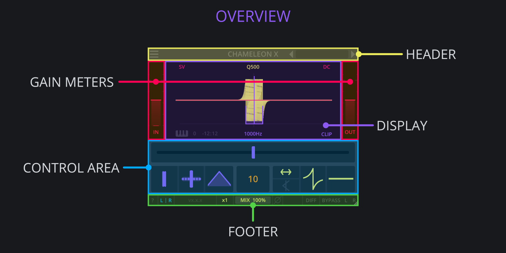
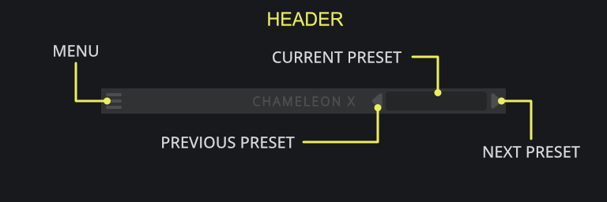
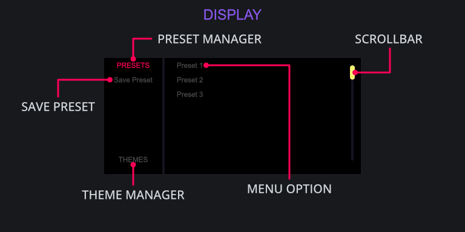
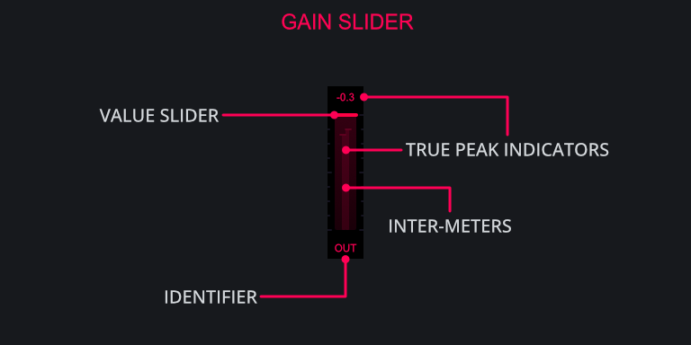
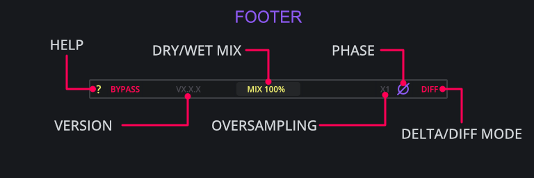

# Controls {#sec:controls}

## DarkPalace Studio Plugins Overview

All DarkPalace Studio plugins share common UI elements as well as general interactions with the 
majority of widgets. Shared components include:

- Header
- Display
- Gain Meters
- Control Area
- Footer

Whereas shared interactions include:

- Double-Clicking on a widget to reset it to its default value.
- Holding `SHIFT` or `CTRL` while dragging a widget to allow for precise adjustments.
- Using the mouse-wheel to adjust a widget in incremental steps.
- Hovering over a widget for a short time shows a tooltip.
- Changing the value of any widget makes a tooltip show the current value.
- Pressing the `?` button *(located bottom-left)* will turn on explanations.
- The plugin can be scaled by dragging any of the sides or corners.

<h2 class="txt-yellow">Header</h2>

Shared across all DarkPalace Studio plugins, the header is a central component for managing 
various aspects including loading and saving presets as well as loading themes.

### Menu-Button
*(Located left of the  Header)*\
Click to open the menu to browse presets and themes.

### Previous-Preset-Button
*(Located center-right of the Header)*\
Click to cycle through presets in reverse order.

### Current-Preset-Button
*(Located right of the Header)*\
Displays the name of the currently selected preset. Click to open up the menu.

### Next-Preset-Button
*(Located right of the Header)*\
Click to cycle through presets in forward order.

<h2 class="txt-purple">Display/Menu</h2>

Shared across all DarkPalace Studio plugins, The display component contains the preset-manager
and theme-manager windows that allow you to browse the various presets and themes available.
Feel free to explore the presets and themes to get a taste for creative opportunities!

### Preset-Manager-Button
*(Located top-left of the Display)*\
Click to switch to the preset-manager mode, will display a list of available presets.

### Save-Preset-Button
*(Located top-left of the Display)*\
Click to save a preset, make sure the preset-manager is active by having PRESET in the top-left 
of the display highlighted. Clicking this will open up File-Dialogue where you will be prompted 
for a name and location.

### Theme-Manager-Button
*(Located bottom-left of the Display)*\
Click to switch to the preset-manager mode, will display a list of available themes.

### Menu Options
*(Located right side of the Display)*\
Will display the available options based on which mode is active on the left side of the Display.
When there is a large amount of options, the scroll-bar can be used as well as the mouse-wheel
to view more options.

<h2 class="txt-red">Gain Meter (Input/Output)</h2>

Shared across all DarkPalace Studio plugins, the Gain components allow for adjustment to the input
and/or output signal of the plugin with some DarkPalace plugins offering a change in functionality.

### Identifier
*(Located top of the Meter)*\
Displays the current position in the processing chain of the slider. 

#### In
The **IN** gain slider controls the volume of the signal being sent into the plugin with a range
of -12dB to +12dB.

The in gain is applied at the beginning of the processing chain and can thus be used to drive the clipper.

#### Out
The **OUT** gain slider controls the volume coming out of the plugin with a range od -12dB to +12dB.
This is clean digital gain that does not color the sound in any way by itself.

The out gain is applied after clipping the signal.

### Value-Slider
*(Located bottom of the Meter)*\
Click and drag to change the value of the slider. A label will show up with the current value.

### True-Peak Indicators
*(Located top of the Meter)*\
Displays the current true-peak value of the signal. If the signal is mono the inter-meters will show
a singular line whereas a stereo signal will display separate left/right inter-meters.

<h2 class="txt-green">Footer</h2>

Shared across all DarkPalace Studio plugins, the footer component contains a set of controls that
enhance the workflow such as flipping the phase/polarity, enabling delta/diff mode and even a 
global dry/wet mix.

### ?-Button
*(Located Left of the Footer)*\
Click to activate 'Help' mode which will display explanations directly within the 
plugin window when hovering over a control.

### Bypass-Button
*(Located Left of the Footer)*\
Click to enable bypass mode which will directly route the input signal to the output signal and
completely bypassing the plugin. Most of the UI will also become grey-scale indicating its state.

### Version
*(Located Left-ish of the Footer)*\
Displays the current version of the plugin. If 'Help' mode is enabled via the '?'-button, the
window will display the commit-hash of the plugin.

### Mix-Slider
*(Located center of the Footer)*\
Click and drag to blend continuously between the processed and unprocessed signal allowing for 
parallel-processing behavior.

### Oversampling-Slider
*(Located right of the Footer)*\
Click and drag to change oversampling up to 1x, 2x and 4x which can often help by optimizing and/or 
reducing distortion characteristics.

The oversampling process includes filters aimed at removing upsampling artifacts as well as
removing useless frequency content introduced by the oversampling process. For this purpose,
the Chameleon Plugins uses FIR filters for oversampling.

Increasing oversampling will also introduce additional delay and increases processing requirements
which is reported to the host to be automatically compensated for by most modern DAWs.

While allpass filters generally do not benefit from an increased sampling rate, some of the plugins
in the Chameleon Suite offer a clipping option due to drastic changes 
being able to introduce increased signal dynamics. Oversampling can have a positive impact to preset 
said anomalies. 

As allpass filters are mostly only concerned about the phase relationship of the signal, be aware
that enabling oversampling can and will introduce additional phase shift in the higher frequency
range due to the filter used when up- and down-sampling.

Please note that a change in oversampling can result in audio-dropouts. It is not
advices to automate this control.

### Phase-Button
*(Located right of the Footer)*\
Click to cycle through 3 different phase states:

- No-Phase, which leaves the signal as is.
- Pre-Phase, which inverts the polarity at the input stage, before processing.
- Post-Phase, which flips the phase at the output of the plugin, after MIX.

### Diff-Button
*(Located right of the Footer)*\
Click to enable 'Diff' mode which will output the Difference/Delta in signal between the input
and output.

Note that **DIFF** is applied before the **MIX** slider.

<h2 class="txt-blue">Common Controls</h2>

Shared primarily across the Chameleon Suite plugins are a set of
controls including:

- DC Button
- CLIP Button
- Order Count
- Frequency Slider
- Q Slider

### DC-Button (N, X)
*(Located top-right of the Display)*\
Applies a 10Hz first order high-pass-filter to the output to account for any DC-Offset which 
might be introduced by the plugin.

Generally the frequency response of allpass filters is flat. However, automating the parameters 
of multiple allpass filters can often introduce some significant changes causing dc offset that 
can potentially damage your speakers and headphones.

Adding a high-pass-filter will also increase some phase rotation at low frequencies.

### CLIP (N, X)
*(Located bottom-right of the Display)*\
Click to cycle through 3 stages of clipping:

- No-Clip, which leaves the signal as is.
- Output-Clip, which will hard-clip the output signal.
- Per-Filter-Clip, which will clip the signal per-filter-instance.

#### No Clip
No clipping is applied in this mode.

#### Output Clip
Clips the output at 0db

#### Per-Filter Clip
Clips after each allpass filter and at the output.
Each allpass filter stage alters the sound in a tiny bit, resulting in tiny differences in the waveform.

This is a great option for sound design work as it offers some unique sounds.

Modulating any of the parameters can introduce strong resonant peaks, and potentially self-oscillating 
filters. Those can cause a massive energy buildup, which can potentially damage your speakers, 
headphones and ears. Clipping the output to a maximum of 0dB offers some protection for such measures.

### Frequency
*(Located in the center of the Control-Area)*\
Click and drag to change the center frequency of the allpass filter(s).

- Chameleon 1 (first-order allpass filter) this corresponds to the 
frequency that has the steepest change in phase
  rotation.
- Chameleon 2 and N (second-order allpass filters) this corresponds 
to the frequency that has the maximum amount of
  phase rotation.
- Chameleon X this is the frequency of the central frequency. More 
allpass filters are added based on the other
  parameters of the plugin

Note that the plugin configuration offers the option to select between linear or exponential frequency control.
See section @sec:configuration for detailed instructions.

### Q (2, N, X)
*(Located right of the Control-Area)*\
Click and drag to adjust the Q value of the filter. Changing this will adjust the bandwidth where 
a narrow bandwidth affects only a small range of frequencies, and a large bandwidth affects a large 
range of frequencies.

In an allpass filter the Q value determines the range over which the phase rotation happens. 
This allows to confine the space rotation to a very small area or to spread it out over the 
full spectrum. As the absolute change of phase rotation is fixed, the q control effectively 
adjusts the steepness of the phase change.

### Order (N, X)
*(Chameleon N: Located left of the Control-Area.)*\
*(Chameleon X: Located center of the Control-Area.)*\
Click and drag to change the amount of filters being stacked.

Both Chameleon N and Chameleon X 
come with the addition of the **Order** Control that allows you to stack multiple allpass filters upon 
each-other. Stacking multiple allpass filters increases the phase rotation and overall delay usually 
resulting in dispersed sounds.

In Chameleon N all the filters are stacked onto a central frequency 
whereas in Chameleon X additional distribution controls are available.

<h2 class="txt-blue">Chameleon X Specific Controls</h2>

### Frequency Width
*(Located left of the Control-Area)*\
Click and drag to change the total width over which the filters are spread out.

### Frequency Offset
*(Located left of the Control-Area)*\
Click and drag to offset the placement of the filters relative to the center frequency.

At the zero position the allpass filters are distributed around the central frequency, while smaller and larger values
will move the frequency distribution to lower and higher frequencies respectively.

### Frequency Skew
*(Located center-right of the Control-Area)*\
Click and drag to change the placement of the filters relative to the distribution width.

- Values smaller than zero will "pinch" the filter towards the center frequency.
- Value of 0 will distribute the filters equally linearly.
- Values higher than zero will "bloat" the filters away from the center frequency.

### Filter Sorting
*(Located Center-Right of the Control-Area)*\
Click to change the order in which the filters are placed based:

- Ascending (right arrow), places them from lower to higher frequencies.
- Descending (left arrow), places them from higher to lower frequencies.
- Interleaved (left and right arrow), places them from the center outwards.

### Filter Foldback
*(Located center-right of the Control-Area)*\
Click to enable foldback of filters that go outside the audible range.

- A filter that would sit at 10Hz (5Hz below the lowest allowed frequency) will be moved to 20 Hz 
(5Hz above the lowest allowed frequency).
- A filter that would sit at 22kHz (2kHz above the highest allowed frequency) will be moved to 18 kHz 
(2kHz below the highest allowed frequency).

When disengaged, filters will stack at the limits of the allowed frequency range.

### Q Skew
*(Located center-right of the Control-Area)*\
Click and drag to change the Q values of the filters dependant on the frequency.

- Values higher than zero will increase the Q based on ascending frequency
- Values of zero will set all filters to the same Q value.
- Values lower than zero will increase the Q based on descending frequency

