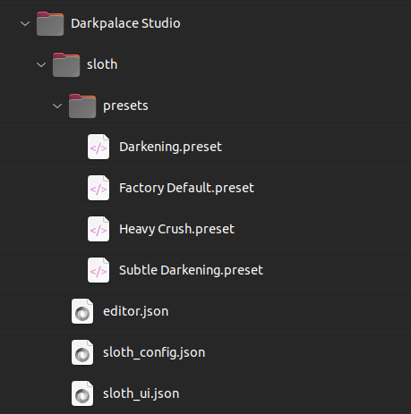
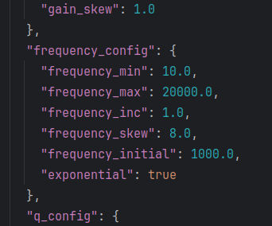

# Configuration

All Darkpalace Studio plugins are highly customizable. This works via `json` configuration files.

## Configuration files

- `[pluginName]_ui.json`: customize the look of the plugin. This also allows to create a custom themes.
- `[pluginName]_config.json`: customize the parameter ranges of the plugin. **Warning**: Modifying this file can result
  in a
  flawed user experience and potentially dangerous output levels.
- `editor.json`: save the last used plugin size.

The configuration files are required to be placed in the following folders:

- **Win**: `C:\Users\Public\Documents\Darkpalace Studio\[pluginName]`
- **Mac**: `/Users/Shared/Darkpalace Studio/[pluginName]`
- **Linux**: `~/.config/Darkpalace Studio/[pluginName]`

If no json file is found or if the json is invalid (e.g. a typo or a missing entry), the plugin will use default
settings.

{ width=250px }

The original `json` files can be found in the zip file and easily edited with a standard text editor.
If you encounter any issues with editing `json` files, you can visit [jsonlint.com](https://jsonlint.com/) for
validation.

### Fix for broken UI Scaling on Windows

Windows does not consistently forward the ui scaling to plugins.
If you are using windows settings to scale your screen and the plugin looks weird (e.g. as shown in the picture below),
you can fix this by changing the value `custom_ui_scaling_factor` in the config
file `C:\Users\Public\Documents\Darkpalace Studio\[pluginName]\[pluginName]_ui.json`.

When your Windows Settings show a display scaling of 125%, you need to set `custom_ui_scaling_factor` to `1.25`
respectively.

TODO add incorrectly scaled plugin picture

### Frequency Slider Scaling

Frequencies are not perceived linear. A change from 440Hz to 880Hz is one octave, and so is the change from 880Hz to
1760Hz.
Thus, the normal behavior of the frequency sliders is to scale exponentially. If you desire to have a linear behavior,
this can be achieved by setting a value in the respective plugin config.

The config json file contains a block named `frequency_config`, containing a setting `exponential`, which is set to true
by default.

To enable linear frequency slider scaling:

- change the value of `"exponential"` to `false`
- change the value for `"frequency_skew"` to `1.0`

Note that this can be configured for each plugin individually.

## Presets

Presets are `xml` files that can easily be shared and edited.
They are stored in the following folder:

- **Win**: `C:\Users\Public\Documents\Darkpalace Studio\[plugin_name]\presets`
- **Mac**: `/Users/Shared/Darkpalace Studio/[plugin_name]/presets`
- **Linux**: `~/.config/Darkpalace Studio/[plugin_name]/presets`

Another option is to click the **Save Preset** button in the menu.
This will open the system dialog that will directly show you the folder where presets are stored.
