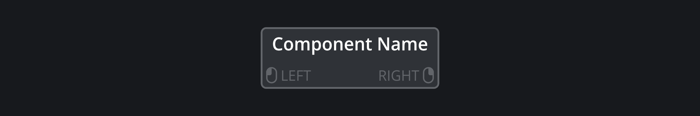

# Controls {#sec:controls}

## Overview

### Shared Regions
In order to easily distinguish the various elements of the plugins as well as make manual navigation easier,
all of our plugins can be separated into shared regions:

- Header
- Display
- Gain Meters
- Control Area
- Footer

### Shared Interactions
In order to keep a consistent playing-field, our plugins share common interactio methods such as:

- Double-Click: Reset to default values.
- Hold SHIFT or CTRL: Precision mode, smaller incremental values
- Mouse-Wheel: Incremental Steps.
- Hover over a Widget: Shows a tooltip.
- Adjust a Widget: Shows tooltip with the current value.
- [?]-Button: Shows explanations when hovering over widgets.
- Resize: Done by grabbing any of the sides or corners.

### Visual Feedback
A lot of the widgets within our plugins are designed to provide visual feedback to indicate a change 
is occuring. Additionally this is aided by the toolip and explanation system.

#### Explanations
When help mode is enabled *(Located left of the footer indicated by a '?')*, hovering over any widget
will show a window containing an explanation of its functionality.

#### Tooltip

When hovering over any of the widgets, a tooltip will show up containing the name of the widget. 
Additionally, the tooltip will also display if a widget has a special interaction
associated with it, e.g. a dedicated right mouse button interaction.
This is indicated by a Left and Right Mouse-Button Icon as well as the name of the action.

