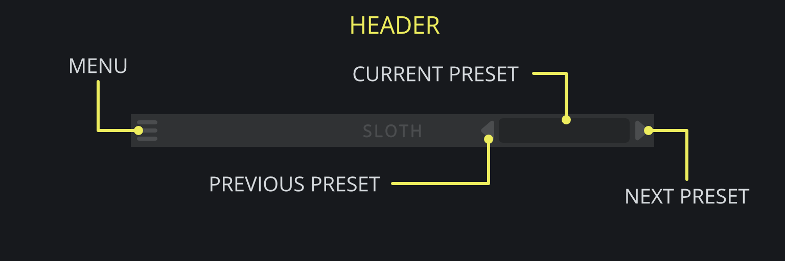

<h2 class="txt-yellow">Header</h2>

Shared across all Darkpalace Studio plugins, the header is a central component for managing 
various aspects including loading and saving presets as well as loading themes.

### Menu-Button
*(Located left of the  Header)*\

- Left-Click: Opens the menu.

### Previous-Preset-Button
*(Located center-right of the Header)*\

- Left-Click: Cycle through the presets in backward order.

### Current-Preset-Button
*(Located right of the Header)*\

- Left-Click: Opens the menu.

### Next-Preset-Button
*(Located right of the Header)*\

- Left-Click: Cycle through the presets in forward order.

