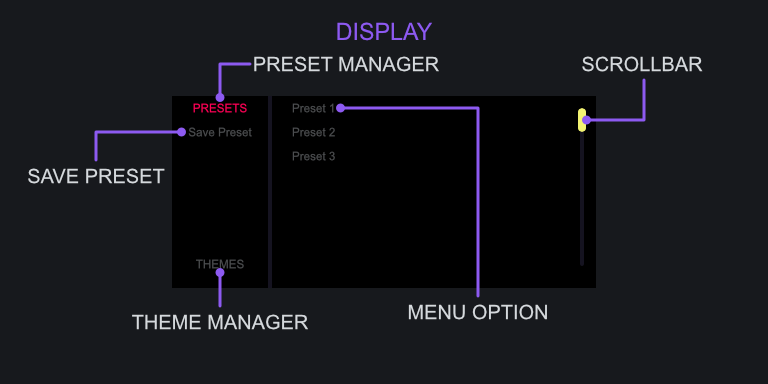

<h2 class="txt-purple">Menu</h2>

The Display Widget allows you to browse the various presets and themes that are available. When
a preset or theme is incompatible with the current version the item will be displayed with a 
strikethrough.

### Preset Button
*(Located top-left of the Display)*\

- Left-Click: Switch to the Preset-Manager.

### Save-Preset Button
*(Located top-left of the Display)*\

- Left-Click: Save the current information to a preset.

The Save Preset button will only appear when the Preset-Manager is active, indicated by PRESET being
highlighted. Saving is handled through your systems File-Dialogue window where you will be prompted
for a name and location.

### Theme Button
*(Located bottom-left of the Display)*\

- Left-Click: Switch to the Theme-Manager.

### Menu Options
*(Located right side of the Display)*\

- Left-Click: Select Preset.
- Mouse-Wheel: Move Window Up/Down.

Displays the available options based on which mode is active on the left sideo of the Display.
When there is a alrge amount of options, the scroll-bar on the right side can be used as well as 
the Mouse-Wheel to go up/down within the window.

