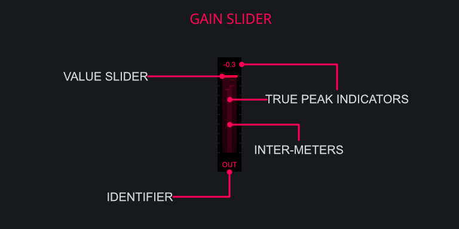

<h2 class="txt-red">Gain Meter (Input/Output)</h2>

The Gain components allow for adjustment to the input
and/or output signal of the plugin with some Darkpalace plugins offering a change in functionality.

### Identifier
*(Located below the Meter)*\
Displays the current position in the processing chain of the slider. 

#### In
*(Located on the left side of the plugin)*\
The **IN** gain slider controls the volume of the signal being sent into the plugin with a range
of -12dB to +12dB.

The in gain is applied at the beginning of the processing chain.
It can be used to drive any dynamic effects of the plugin.

#### Out
*(Located on the right side of the plugin)*\
The **OUT** gain slider controls the volume coming out of the plugin with a range od -12dB to +12dB.
This is clean digital gain that does not color the sound in any way by itself.

The out gain is applied after all internal processing.

### Value-Slider
*(Located bottom of the Meter)*\

- Left-Click and Drag: Adjust value of the Gain.

### True-Peak Indicators
*(Located top of the Meter)*\
Displays the current true-peak value of the signal.
If the signal is mono, the inter-meters will show a singular line whereas a stereo signal will display separate left/right inter-meters.

When switched to M|S mode, the peak indicators will display the peak values for the mid- and side channel respectively.

