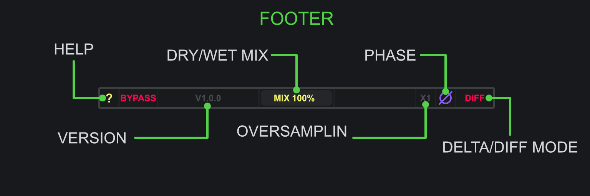

<h2 class="txt-green">Footer</h2>

The footer component contains a set of controls that
enhance the workflow such as flipping the phase/polarity, switching between Left-Right and Mid-Side processing, enabling delta/diff mode, bypassing the complete plugin or individual channels and finally a global dry/wet mix.

### ?-Button
*(Located left in the Footer)*\

- Left-Click: Toggle 'Help' mode.

When enable, 'Help' mode will display explanations directly within the plugin window when hovering over a widget.

### Process Mode Button
*(Located left in the Footer)*\

- Left-Click: Toggle Processing Mode.

The plugin can operate in both Left/Right and Mid/Side processing modes. Conversion to the
respective mode is done before any processing is applied. Likewise, conversion back to the original 
channel configuration is performed at the end of the processing chain. Aditionally, the mode will 
also effect the single-channel bypass options.

### Version
*(Located left in the Footer)*\
Displays the current version of the plugin. If 'Help' mode is enabled via the **?**-button, the
explanation will display the exact commit-hash of the plugin.

### Oversampling-Slider
*(Located left-ish in the Footer)*\

- Left-Click and Drag Left/Right: Change Oversampling value.

The max oversampling value varies depending on the plugin. A value of **1x** will always
indicate no oversampling.

The oversampling process includes filters aimed at removing upsampling artifacts as well as
removing useless frequency content introduced by the oversampling process. For this purpose,
Darkpalace Studio plugins use FIR filters for oversampling.

Increasing oversampling will introduce additional delay and increases processing requirements.
The delay is reported to the host to be automatically compensated for by most modern DAWs.

Please note that a change in oversampling can result in short audio-dropouts. It is not
advices to automate this control.

### Mix-Slider
*(Located center of the Footer)*\

- Left-Click and Drag Left/Right: Change Mix value.

The Mix slider allows for blending between an unprocessed (dry) and fully processed (wet) signal, allowing for parallel processing behaviour.

### Phase-Button
*(Located right of the Mix slider)*\

- Left-Click:  Cycle thruogh Phase modes.

All Darkpalace Studio plugin support 3 different phase modes for processing:

- No-Phase: Leave signal as is, no change.
- Pre-Phase: Inverts the polarity at the input stage, before processing.
- Post-Phase: Inverst the polarity at the output statge, after the mix.

The different phase options allow to create interesting results when mixing the processed signal with the dry signal or using the **DIFF** option.

### Diff-Button
*(Located right in the Footer)*\

- Left-Click:  Toggle Difference/Delta mode.

When enabled the plugin will not output the processed signal, but instead the difference between the unprocessed and processed signal, effectively providing the difference (or delta) of the processing.

Note that **DIFF** is applied *before* the **MIX** slider. This allows to blend the delta-signal with the dry signal for additional parallel processing options.

### Bypass-Button
*(located right in the Footer)*\

- Left-Click:  Toggle Bypass.

When Bypass mode is enabled, the input signal is directly routed to the output, bypassing the entire
signal processing chain. Additionally, the plugin will also turn grey-scale indicating its state.

Note that internal oversampling and process mode conversion will still be performed, even if bypass is enabled.

Most DAWs offer the option to bypass a plugin. However this will also bypass oversampling, potentially resulting in clicks.
The internal bypass avoids this issues.

#### Individual Channel Bypass
*(located right in the Footer)*\

- Left-Click:  Toggle Bypass an individual Channel.

This allows to bypass an individual channel, based on the Processing Mode. 
Thus it is possible to bypass none, one or both of L/R or M/S channels, giving plenty of options, 
e.g. just processing the Mid channel. 
Additionally, the bypassed channel will be highlighted indicating its state.

