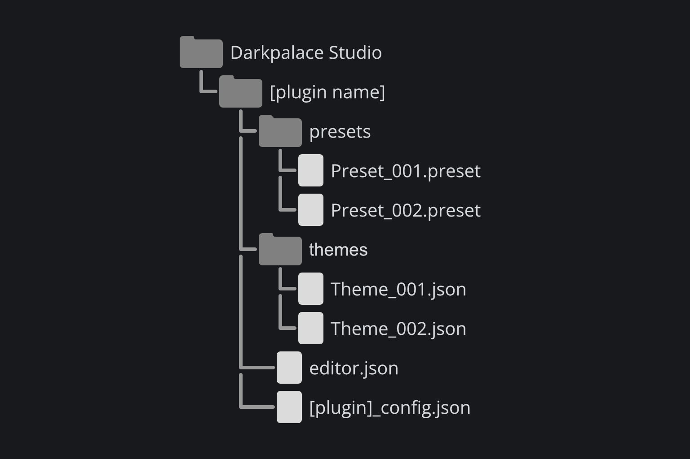
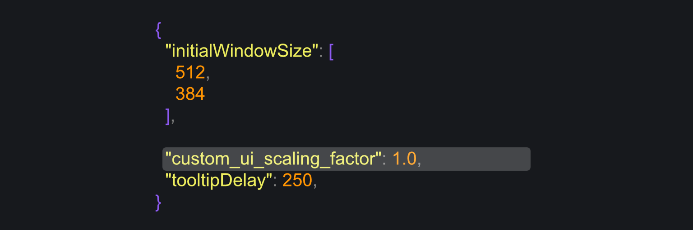

# Configuration {#sec:configuration}

## Configuration files
All Darkpalace Studio plugins are highly customizable by changing settings via the json 
configuration files. This includes changing some additional settings as well as creating custom
themes.

As mentioned back in @sec:installation, the files are required to be in specific locations depending
on your operating system:

- **Win**: `C:\Users\Public\Documents\Darkpalace Studio\[pluginName]\`
- **Mac**: `/Users/Shared/Darkpalace Studio/[pluginName]/`
- **Linux**: `~/.config/Darkpalace Studio/[pluginName]/`

The original `json` files can be found in the zip file and easily edited with a standard text editor.
If you encounter any issues with editing `json` files, you can visit [jsonlint.com](https://jsonlint.com/) for
validation.

### \[PluginName]_config.json
The name of this file is usually *plugin dependant*. e.g. you are browsing the files for Sloth,
this would mean the file would be called sloth_config.json.

On top of that, this file contains plugin-specific settings which can be changed to alter the
functionality of the plugin. e.g. you would like to change the frequency scaling in a plugin from
exponentially to linearly. You can achieve this by changing the following settings in the respective 
plugin:

- Change the value of "exponential" to false
- Change the value for "frequency_skew" to 1.0

If no json file is found or if the json is invalid (e.g. a typo or a missing entry), the plugin 
will use default settings. 

### editor_config.json
Stores the last used window-size as well as the currently selected theme

If no json file is found or if the json is invalid (e.g. a typo or a missing entry), the plugin 
will use default settings. 

### Fix for broken UI Scaling on Windows

Windows is known to not always be consistent, this including letting applications know of the ui-scaling
factor it uses. Because of this the GUI of Darkpalace Studio plugins can often look out of proportions.
In order to address this you will have to change a value in the json file of the theme you are using.

The themes folder should be located in the data:

- **Win**: `C:\Users\Public\Documents\Darkpalace Studio\[pluginName]\themes\`
- **Mac**: `/Users/Shared/Darkpalace Studio/[pluginName]/themes/`
- **Linux**: `~/.config/Darkpalace Studio/[pluginName]/themes/`

After this open the respective JSON file for the current theme and look for the value 
custom_ui_scaling_factor key which should be located at the top
of the file.

Once you've found this, change is to a decimal value representing your display-scaling value.
e.g. If your display-scaling is set to 125% in windows, change the value of custom_ui_scaling_factor
to 1.25.

## Presets
Presets are `xml` files that can easily be shared and edited.
They are stored in the following folder:

- **Win**: `C:\Users\Public\Documents\Darkpalace Studio\[plugin_name]\presets`
- **Mac**: `/Users/Shared/Darkpalace Studio/[plugin_name]/presets`
- **Linux**: `~/.config/Darkpalace Studio/[plugin_name]/presets`

Another option is to click the **Save Preset** button in the menu.
This will open the system dialog that will directly show you the folder where presets are stored.

## Themes
### How to switch themes
In the plugin, click on the menu button (the three lines) in the top left corner.
In the left half of the display, select **THEMES**. Then select the themes on the right side.

If no themes are listed, make sure the theme files are installed in the correct folder.

### Themes folder location
Theme files can be found in the following folder:

- **Win**: `C:\Users\Public\Documents\Darkpalace Studio\sloth\themes`
- **Mac**: `/Users/Shared/Darkpalace Studio/sloth/themes`
- **Linux**: `~/.config/Darkpalace Studio/sloth/themes`

## Preset and Theme versions
presets and themes have specific versions.
While we strive to make compatibility with new versions of the plugin the top priority, this can not always be ensured.
If a preset or theme is crossed out, it means that it has an old version and needs to be updated.
Please refer to the last section of this manual (Release Notes) to check changes that need to be adapted to.

