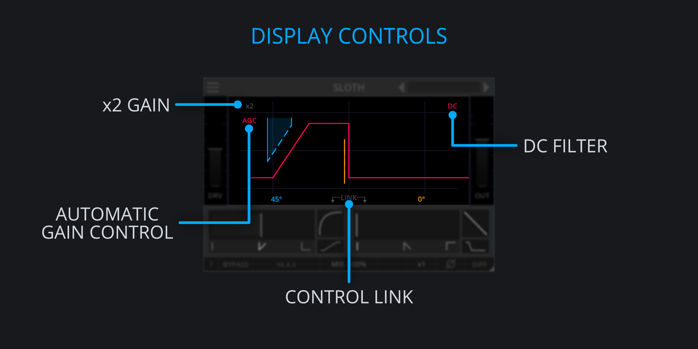

<h2 class="txt-blue">Display Controls</h2>

### x2
*(Located top-left of the Display)*\

- Left-Click: Toggle X2 mode.

When enabled, the input signal is doubled in volume causing slopes to become steeper and as a result
makes the Slew-Limiting process more aggressive.

The increase in volume will be compensated for, independently of AGC.

### AGC
*(Located top-left of the Display)*\

- Left-Click: Toggle AGC.

**A**utomatic **G**ain **C**ompensation will attempt to compensate for any change in input-gain
to keep things as balanced as possible. Additionally, the In-Gain-Meter will change its state to DRIVE allowing the signal to be pushed louder into the Slew-algorithm resulting in more aggressive Slew-Rate-Limiting. This means the In-Gain-Meter on the left of the display has additional functionality:

- AGC Enabled: The widget controls the DRIVE.
- AGC Disabled: The widget controls the input signal.

AGC will not take output gain or any change in volume from the Slew-Rate-Limiting into account.
This means the output can actually have a lower volume which can be compensated for with the 
Out-Gain-Meter

### DC-Button
*(Located top-right of the Display)*\

- Left-Click: Toggle a 10Hz DC-Filter.

When enabled a 10Hz first-order high-pass-filter will be applied to the output signal to account
for any DC-Offsets which might be introduced by the Slew-Rate-Limiting Algorithm.

Generally the asymmetric Slew-Rate-Limiting (Meaning different values for Rise and Fall) results
in a DC offset at the output state. This can be understood by the fact that asymmetric Slew-Rate-limiting 
will "reduce" e.g. any rising slopes, while leaving falling slopes untouched. Effectively this leads 
to a shift of the complete waveform to negative values which can be solved by using a High-Pass-Filter.

Adding a high-pass-filter will also increase some phase rotation at low frequencies.

### Link
*(Located bottom-center of the Display)*\

- Left-Click: Toggle Control Linking.

When enabled, the Slew-Widgets (Slew-Rate, Slew-Curve and Slew-Time) are adjusted for in tandem. 
This provides easy access to symmetric Slew-Rate-Limiting where rising and  falling slopes are 
treated similarly.

Please note that this will only affect changes made via the interface and not automation.
If automation is used to change any of the parameters when linking is enabled, only the automated
parameter will change whereas the other counterpart will remain unaffected.

This is to done avoid potentially conflicting input from different automation tracks.

