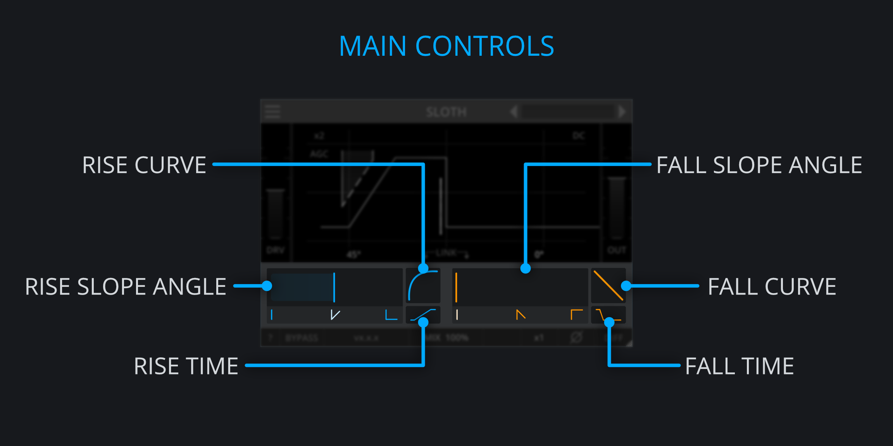

<h2 class="txt-blue">Control Area</h2>

The fall and rise controls are basically the same so the following information will
apply to both of them.

### Slew Slope Angle
*(Located on the left side of a slew group)*\

- Left-Click and Drag Left/Right: Adjust angle of the Slew-Rate.

The Slew-Rate/angle applied to the incoming signals with higher values resulting in shallower Slew-Rate. 
If the slope of the input signal is steeper than the Slew-angle, the output signal will be Slew-rate-limited.

### Slew-Curve
*(Located on the upper-right side of a slew group)*\

- Left-Click and Drag Up/Down: Adjust slope curvature,

Based on the position, the values will blend between:

- Square-Root: Towards a value of 1.0.
- Linear: Around value of 0.0.
- Quadratic: Towards as value of -1.0.

This can have an effect on brightening or darkening a sound and is a great option for shaping
transients as well.

### Slew-Time
*(Located on the lower-right side of a slew group)*\

- Left-Click and Drag Left/Right: Adjust Slew-Time.

Slew-Time controls how fast the behaviour of the Slew-Curve is applied with higher values resulting 
in a faster transition through the selected Slew-curve. This will only have an effect when the 
Slew-curve setting is non-zero.

