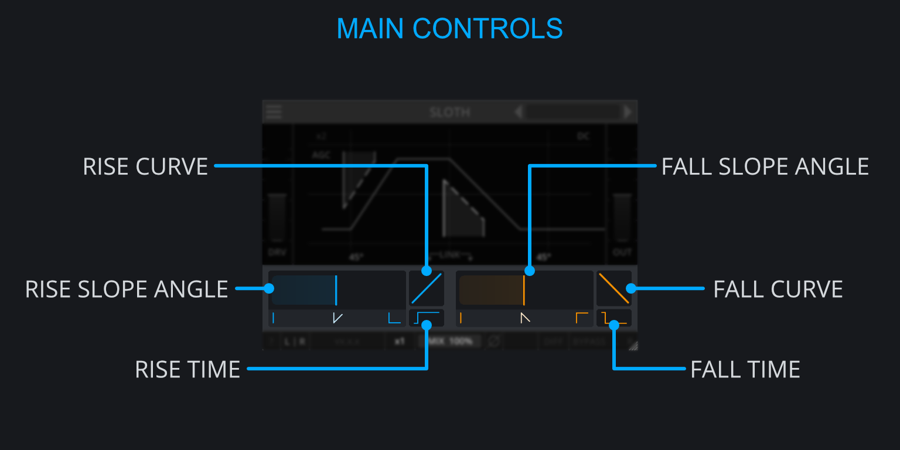
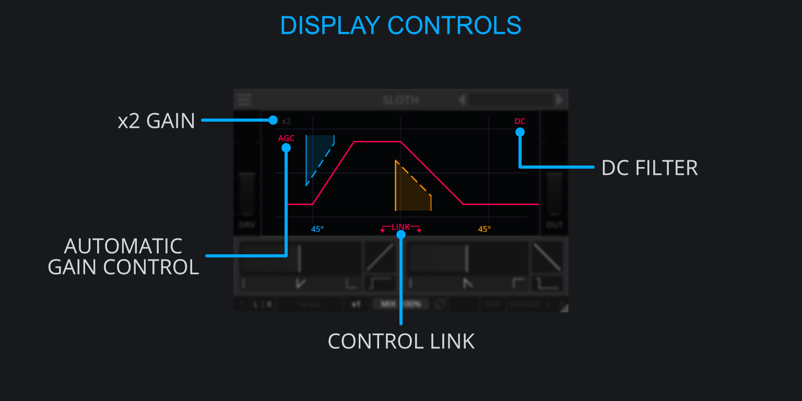

<h2 class="txt-blue">Control Area</h2>

The fall and rise controls are basically the same so the following information will
apply to both of them.

### Slew Slope Angle
Click and drag to adjust the Slew-Rate/angle applied to the incoming signals with higher values resulting in shallower Slew-Rate. 
If the slope of the input signal is steeper than the Slew-angle, the output signal will be Slew-rate-limited.

### Slew-Curve
Click and drag to adjust the curvature of the slope. Based on the position, the values will blend between:

- Square-Root at a value of 1.0
- Linear at a value of 0.0
- Quadratic at a value of -1.0

This can have an effect on brightening or darkening a sound and is a great option for shaping
transients as well.

### Slew-Time
Click and drag to change how fast the behavior of the Slew-Curve is applied.
With higher values resulting in a faster transition through the selected Slew-curve. 
This will only have an effect when the Slew-curve setting is non-zero.

<h2 class="txt-blue">Display Controls</h2>

### x2
*(Located top-left of the Display)*\
Click to increase the input gain by a factor of 2 causing slopes to become steeper and as a result
makes the Slew-limiting more aggressive.

The increase in volume will be compensated for, independently of AGC.

### AGC
*(Located top-left of the Display)*\
Click to toggle **A**utomatic **G**ain **C**ompensation which will attempt to compensate for any
change in input-gain.

When enabled, the In-Gain-Meter will change its state to DRIVE allowing the signal to be forced
louder into the Slew-algorithm resulting in more aggressive Slew-Rate-Limiting. This means the 
In-Gain-Meter on the left of the display has additional functionality:

- When AGC is **on**, this slider controls the **DRIVE**, as the change in volume is automatically compensated
  for.
- When AGC is **off**, this slider controls the **IN**, simply boosting the input.

AGC will not take output gain or any change in volume from the Slew-Rate-Limiting into account.
This means the output can actually have a lower volume which can be compensated for with the 
Out-Gain-Meter

### DC-Button
*(Located top-right of the Display)*\
Click to apply a 10Hz first order high-pass-filter to the output to account for any DC-Offset 
which might be introduced by Slew-Rate-Limiting.

Generally the asymmetric Slew-Rate-Limiting (Meaning different values for Rise and Fall) results
in a DC offset at the output state. This can be understood by the fact that asymmetric Slew-Rate-limiting 
will "reduce" e.g. any rising slopes, while leaving falling slopes untouched. Effectively this leads 
to a shift of the complete waveform to negative values which can be solved by using a High-Pass-Filter.

Adding a high-pass-filter will also increase some phase rotation at low frequencies.

### Link
*(Located bottom-center of the Display)*\
Click to link the Slew-Controls (Slew-Rate, Slew-Curve and Slew-Time) together for changing 
the values in tandem. This provides easy access to symmetric Slew-Rate-Limiting where rising and 
falling slopes are treated similarly.

Please note that this will only affect changes made via the interface and not automation.
If automation is used to change any of the parameters when linking is enabled, only the automated
parameter will change whereas the other counterpart will remain unaffected.

This is to done avoid potentially conflicting input from different automation tracks.

