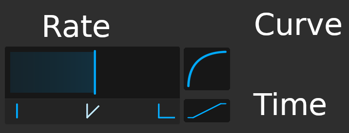
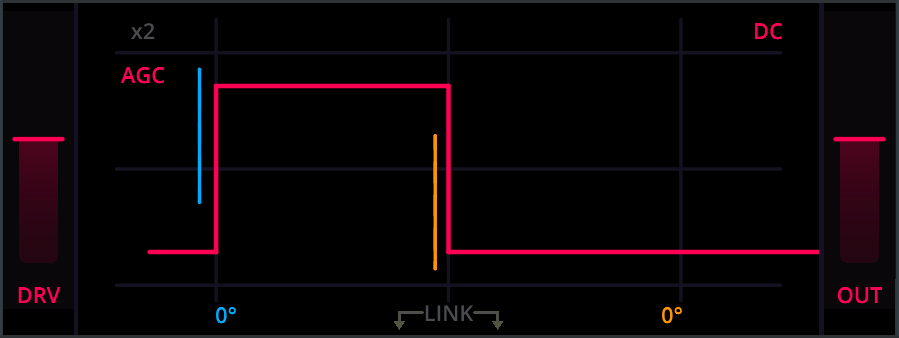

# Controls

- A double click on a slider resets the slider to the default value.
- Holding `SHIFT` or `CTRL` allows for precise adjustments.
- The mouse wheel can be used to adjust a slider in steps.
- Hovering over a control for a short time makes a tooltip show up.
- Changing the value of any slider makes a tooltip show the current value.
- By engaging the `?` button, in-plugin-explanations are turned on.
- The plugin can be resized by dragging any of the sides or corners.

## Slew Controls

### Slew Rate

Adjusts the maximum slew rate.

This is the core control for adjusting slew rate limiting.
Higher values result in a shallower maximum slew rate.
If the slope of the input signal is steeper than the selected slew rate, the output is slew-rate-limited to the selected
slew rate.

### Slew Curve

Controls the curvature of slew-rate-limited slopes.

This transforms the shape of slew-rate-limited slopes from "square root" over "linear" to "quadratic".
Only slopes that are slew-rate-limited are affected.
This usually brightens or darkens the sound and is a great option for shaping transients as well.

### Slew Time

Modifies the time factor of the slew curve.

This changes how fast the square root or quadratic behavior is applied.
This only has an effect, when the slew curve setting is non-zero.
Higher values result in a faster transition through the selected slew curve.

## Header Controls

### Menu

Opens the preset menu.
The preset menu can be used to browse, load and save presets.

### Previous Preset

Loops through the presets in reverse order.

### Current Preset Name

The name of the currently selected preset.
Clicking this control also opens the preset browser.

### Next Preset

Loops through the presets.

\newpage

## Display Controls

### In/Drive

Boosts the input of the plugin.
With increased input, slopes become steeper, thus slew rate limiting will be applied more aggressively.

This slider behaves differently based on AGC:

- When AGC is **on**, this slider controls the **DRIVE**, as the change in volume is automatically compensated
  for.
- When AGC is **off**, this slider controls the **IN**, simply boosting the input.

The number displayed above the slider is the peak value of the input in dB.

### Out

Boosts the output volume of the plugin. Some settings of slew rate limiting lead to a loss in volume. This can be
compensated for with this slider.

The number displayed above the slider is the peak value of the output in dB.

### AGC

Toggles **A**utomatic **G**ain **C**ompensation.
AGC allows to ompensate for any change in input gain.
AGC will not take output gain or any change in volume from the slew rate limiting into account.

When AGC is **on**, increasing **DRIVE** leads to steeper slopes, resulting in stronger slew-rate-limiting.
The enabled AGC will revert the initial increase in gain from the **DRIVE** slider.
Thus the output can actually have a lower volume.
This can be compensated for by the **OUT** slider.

### x2

Increases input gain by a factor of 2.
The increase in volume will always be compensated, independently of AGC.
With increased input, slopes become steeper, thus slew rate limiting will apply more aggressively.

### DC

Applies a 10Hz first order high-pass-filter to the output.
This removes any dc offset introduced by slew rate limiting.

Generally asymmetric slew-rate-limiting (meaning different slew rates for rise and fall) result in dc
offset at the output.
This can be understood by the fact that asymmetric slew rate limiting will "reduce" e.g. any
rising slopes, while leaving falling slopes untouched.
Effectively this leads to a shift of the complete waveform to negative values.
A high-pass-filter can solve this issue.

### Link

Links the slew controls (slew rate, slew curve, slew time) for rising and falling slopes.
This provides easy access to "symmetric" slew rate limiting, where rising slopes are treated similarly to falling
slopes.

Note that this will only affect changes via the UI.
If automation is used to change any of the linked parameters, only the automated one will change, while the linked one
stays untouched.
This is to avoid potentially conflicting input from different automation tracks.

In case you want to automate two parameters, it is recommended to disable link and automate via two tracks (or one
track bound to two parameters, which is supported by many modern DAWs).

## Footer Controls

### ?

Enables explanations directly in the UI. When enabled, You can hover over a control to get a longer
explanation of the functionality.

### Bypass

Routes the input directly to the output, bypassing the plugin completely.

### Version

Displays the version of the plugin.

### Mix

Blends continuously between the processed and unprocessed signal.
This can be used to dial in slew rate limiting quite hard and then blend the processed signal with the original input.

### Oversampling

Selects oversampling. The options include x1 (no oversampling), x2, x4, x8 up to x16.
Increasing this option will help to optimize distortion characteristics. However some highly used distortion plugins do
not offer any oversampling and still sound great.

Increasing oversampling will increase the overall plugin delay and increase processing requirements. This is reported to
the host and automatically compensated for
by most modern DAWs.

Note that a change in oversampling can result in cracks and audio dropouts. It is not advised to automate this control.

### Phase

This will flip the phase of the output of the plugin after all other processing.

### Diff

Allows listening to the difference between the input and output.
Note that **DIFF** is applied before **MIX**.

\newpage
