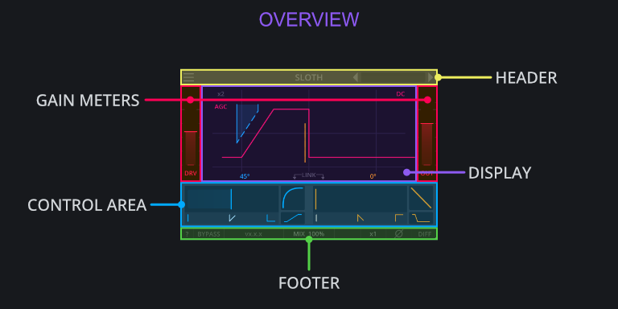
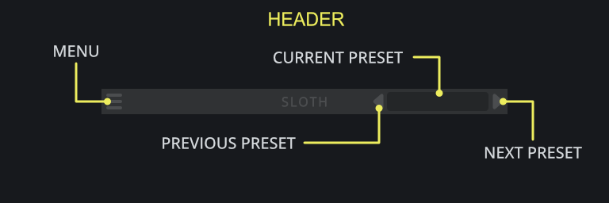
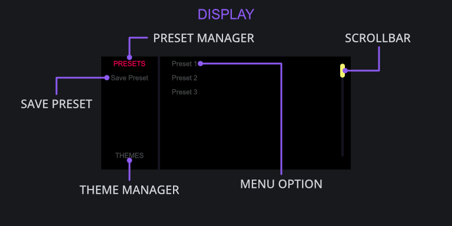
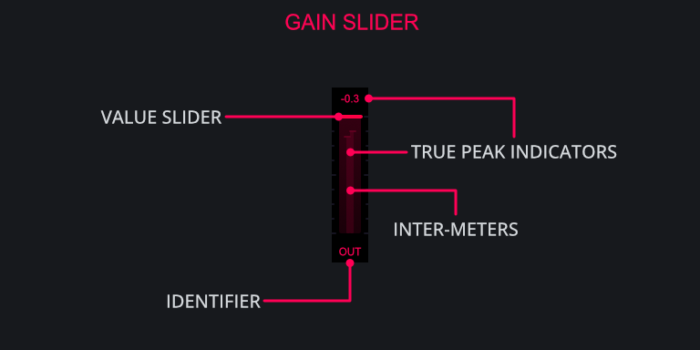
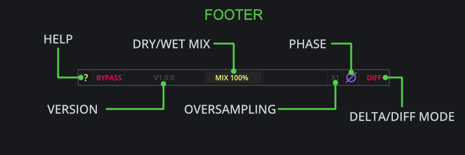

# Controls {#sec:controls}

## Darkpalace Studio Plugins Overview

All Darkpalace Studio plugins share common UI elements as well as general interactions with the 
majority of widgets. Shared components include:

- Header
- Display
- Gain Meters
- Control Area
- Footer

Whereas shared interactions include:

- Double-Clicking on a widget to reset it to its default value.
- Holding `SHIFT` or `CTRL` while dragging a widget to allow for precise adjustments.
- Using the mouse-wheel to adjust a widget in incremental steps.
- Hovering over a widget for a short time shows a tooltip.
- Changing the value of any widget makes a tooltip show the current value.
- Pressing the `?` button *(located bottom-left)* will turn on explanations.
- The plugin can be scaled by dragging any of the sides or corners.

<h2 class="txt-yellow">Header</h2>

Shared across all Darkpalace Studio plugins, the header is a central component for managing 
various aspects including loading and saving presets as well as loading themes.

### Menu-Button
*(Located left of the  Header)*\
Click to open the menu to browse presets and themes.

### Previous-Preset-Button
*(Located center-right of the Header)*\
Click to cycle through presets in reverse order.

### Current-Preset-Button
*(Located right of the Header)*\
Displays the name of the currently selected preset. Click to open up the menu.

### Next-Preset-Button
*(Located right of the Header)*\
Click to cycle through presets in forward order.

<h2 class="txt-purple">Display/Menu</h2>

Shared across all Darkpalace Studio plugins, The display component contains the preset-manager
and theme-manager windows that allow you to browse the various presets and themes available.
Feel free to explore the presets and themes to get a taste for creative opportunities!

### Preset-Manager-Button
*(Located top-left of the Display)*\
Click to switch to the preset-manager mode, will display a list of available presets.

### Save-Preset-Button
*(Located top-left of the Display)*\
Click to save a preset, make sure the preset-manager is active by having PRESET in the top-left 
of the display highlighted. Clicking this will open up File-Dialogue where you will be prompted 
for a name and location.

### Theme-Manager-Button
*(Located bottom-left of the Display)*\
Click to switch to the theme-manager mode, will display a list of available themes.

### Menu Options
*(Located right side of the Display)*\
Will display the available options based on which mode is active on the left side of the Display.
When there is a large amount of options, the scroll-bar can be used as well as the mouse-wheel
to view more options.

<h2 class="txt-red">Gain Meter (Input/Output)</h2>

Shared across all Darkpalace Studio plugins, the Gain components allow for adjustment to the input
and/or output signal of the plugin with some Darkpalace plugins offering a change in functionality.

### Identifier
*(Located top of the Meter)*\
Displays the current position in the processing chain of the slider. 

#### In
The **IN** gain slider controls the volume of the signal being sent into the plugin with a range
of -12dB to +12dB.

The in gain is applied at the beginning of the processing chain and can thus be used to drive the clipper.

#### Out
The **OUT** gain slider controls the volume coming out of the plugin with a range od -12dB to +12dB.
This is clean digital gain that does not color the sound in any way by itself.

The out gain is applied after clipping the signal.

### Value-Slider
*(Located bottom of the Meter)*\
Click and drag to change the value of the slider. A label will show up with the current value.

### True-Peak Indicators
*(Located top of the Meter)*\
Displays the current true-peak value of the signal. If the signal is mono the inter-meters will show
a singular line whereas a stereo signal will display separate left/right inter-meters.

<h2 class="txt-green">Footer</h2>

Shared across all Darkpalace Studio plugins, the footer component contains a set of controls that
enhance the workflow such as flipping the phase/polarity, enabling delta/diff mode and even a 
global dry/wet mix.

### ?-Button
*(Located Left of the Footer)*\
Click to activate 'Help' mode which will display explanations directly within the 
plugin window when hovering over a control.

### Bypass-Button
*(Located Left of the Footer)*\
Click to enable bypass mode which will directly route the input signal to the output signal and
completely bypassing the plugin. Most of the UI will also become grey-scale indicating its state.

### Version
*(Located Left-ish of the Footer)*\
Displays the current version of the plugin. If 'Help' mode is enabled via the '?'-button, the
window will display the commit-hash of the plugin.

### Mix-Slider
*(Located center of the Footer)*\
Click and drag to blend continuously between the processed and unprocessed signal allowing for 
parallel-processing behavior.

### Oversampling-Slider
*(Located right of the Footer)*\
Click and drag to change oversampling up to 1x, 2x and 4x which can often help by optimizing and/or 
reducing distortion characteristics. Increasing oversampling will also introduce additional delay 
and increases processing requirements which is reported to the host to be automatically 
compensated for by most modern DAWs.

Please note that a change in oversampling can result in audio-dropouts. It is not
advices to automate this control.

### Phase-Button
*(Located right of the Footer)*\
Click to cycle through 3 different phase states:

- No-Phase, which leaves the signal as is.
- Pre-Phase, which inverts the polarity at the input stage, before processing.
- Post-Phase, which flips the phase at the output of the plugin, after MIX.

### Diff-Button
*(Located right of the Footer)*\
Click to enable 'Diff' mode which will output the Difference/Delta in signal between the input
and output.

Note that **DIFF** is applied before the **MIX** slider.

<h2 class="txt-blue">Control Area</h2>

The fall and rise controls are basically the same so the following information will
apply to both of them.

### Slew Slope Angle
Click and drag to adjust the Slew-Rate/angle applied to the incoming signals with higher values resulting in shallower Slew-Rate. If the slope of the input signal is stepper than the
output signal will be Slew-rate-limited.

### Slew-Curve
Click and drag to adjust the curvature of the slope. Based on the position, the values will blend between:

- Square-Root at a value of 1.0
- Linear at a value of 0.0
- Quadratic at a value of -1.0

This can have an effect on brightening or darkening a sound and is a great option for shaping
transients as well.

### Slew-Time
Click and drag to change how fast the behavior of the Slew-Curve is applied with higher values resulting in a faster transition through the selected Slew-curve. This will only have an effect
when the Slew-curve setting is non-zero.

<h2 class="txt-blue">Display Controls</h2>

### x2
*(Located top-left of the Display)*\
Click to increase the input gain by a factor of 2 causing slopes to become steeper and as a result
makes the Slew-limiting more aggressive.

The increase in volume will be compensated for, independently of AGC.

### AGC
*(Located top-left of the Display)*\
Click to toggle **A**utomatic **G**ain **C**ompensation which will attempt to compensate for any
change in input-gain.

When enabled, the In-Gain-Meter will change its state to DRIVE allowing the signal to be forced
louder into the Slew-algorithm resulting in more aggressive Slew-Rate-Limiting. This means the 
In-Gain-Meter on the left of the display has additional functionality:

- When AGC is **on**, this slider controls the **DRIVE**, as the change in volume is automatically compensated
  for.
- When AGC is **off**, this slider controls the **IN**, simply boosting the input.

AGC will not take output gain or any change in volume from the Slew-Rate-Limiting into account.
This means the output can actually have a lower volume which can be compensated for with the 
Out-Gain-Meter

### DC-Button
*(Located top-right of the Display)*\
Click to apply a 10Hz first order high-pass-filter to the output to account for any DC-Offset 
which might be introduced by Slew-Rate-Limiting.

Generally the asymmetric Slew-Rate-Limiting (Meaning different values for Rise and Fall) result
in a DC offset at the output state. This can be understood by the fact that asymmetric Slew-Rate-Limiting 
will "reduce" e.g. any rising slopes, while leaving falling slopes untouched. Effectively this leads 
to a shift of the complete waveform to negative values which can be solved by using a High-Pass-Filter.

Adding a high-pass-filter will also increase some phase rotation at low frequencies.

### Link
*(Located bottom-center of the Display)*\
Click to link the Slew-Controls (Slew-Rate, Slew-Curve and Slew-Time) together for changing 
the values in tandem. This provides easy access to symmetric Slew-Rate-Limiting where rising and 
falling slopes are treated similarly.

Please note that this will only affect changes made via the interface and not automation.
If automation is used to change any of the parameters when linking is enabled, only the automated
parameter will change whereas the other counterpart will remain unaffected.

This is to done avoid potentially conflicting input from different automation tracks.

