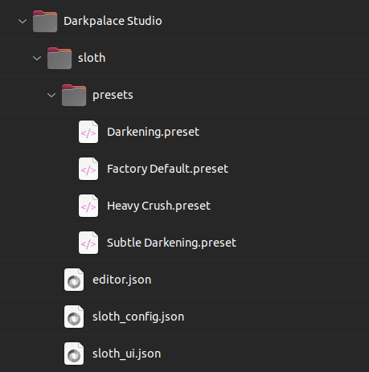
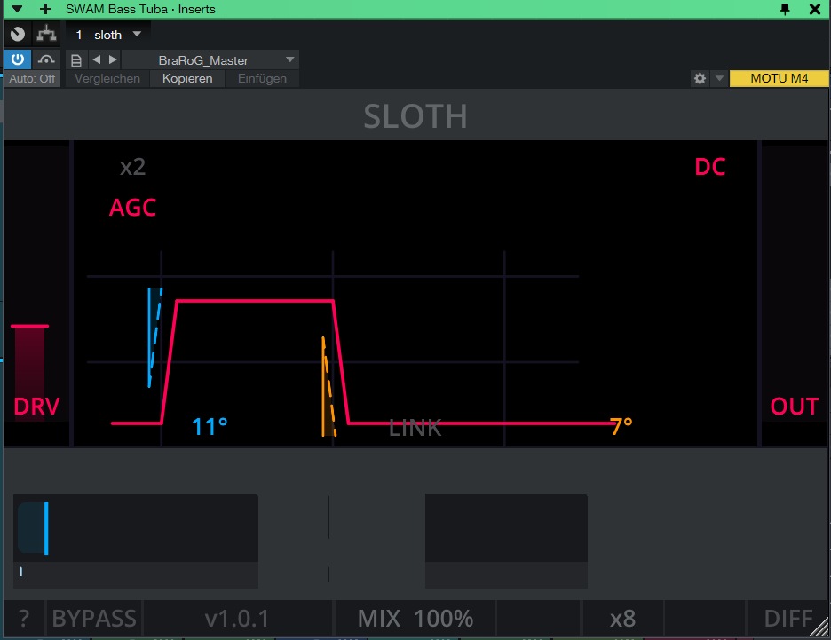
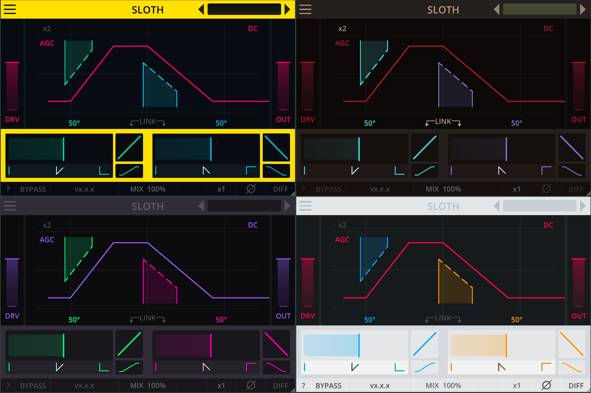

# Configuration

All Darkpalace Studio plugins are highly customizable. This works via `json` configuration files.

## Configuration files

- `themes/*.json`: customize the look of the plugin. This also allows to create your own custom theme.
- `sloth_config.json`: customize the parameter ranges of the plugin. **Warning**: Modifying this file can result in a
  flawed user experience and potentially dangerous output levels.
- `editor.json`: save the last used plugin size.

The configuration files are required to be placed in the following folders:

- **Win**: `C:\Users\Public\Documents\Darkpalace Studio\sloth`
- **Mac**: `/Users/Shared/Darkpalace Studio/sloth`
- **Linux**: `~/.config/Darkpalace Studio/sloth`

If no json file is found or if the json is invalid (e.g. a typo or a missing entry), the plugin will use default
settings.

{ width=250px }

The original `json` files can be found in the zip file and easily edited with a standard text editor.
If you encounter any issues with editing `json` files, you can visit [jsonlint.com](https://jsonlint.com/) for
validation.

\newpage

### Fix for broken UI Scaling on Windows

Windows does not consistently forward the ui scaling to plugins.
If you are using windows settings to scale your screen and the plugin looks weird (e.g. as shown in the picture below),
you can fix this by changing the value `custom_ui_scaling_factor` in the config
file `C:\Users\Public\Documents\Darkpalace Studio\sloth\sloth_ui.json`.

When your Windows Settings show a display scaling of 125%, you need to set `custom_ui_scaling_factor` to `1.25`
respectively.

{ width=250px }

## Presets

Presets are `xml` files that can easily be shared and edited.
They are stored in the following folder:

- **Win**: `C:\Users\Public\Documents\Darkpalace Studio\sloth\presets`
- **Mac**: `/Users/Shared/Darkpalace Studio/sloth/presets`
- **Linux**: `~/.config/Darkpalace Studio/sloth/presets`

Another option is to click the **Save Preset** button in the menu to see where the presets are stored.

\newpage

## Themes

### How to switch themes

In the plugin, click on the menu button (the three lines) in the top left corner.
In the left half of the display, select **THEMES**. Then select the themes on the right side.

If no themes are listed, make sure the theme files are installed in the correct folder.

### Themes folder location

Theme files can be found in the following folder:

- **Win**: `C:\Users\Public\Documents\Darkpalace Studio\sloth\themes`
- **Mac**: `/Users/Shared/Darkpalace Studio/sloth/themes`
- **Linux**: `~/.config/Darkpalace Studio/sloth/themes`

\newpage
